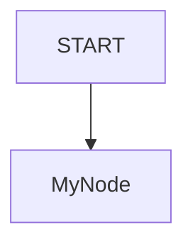
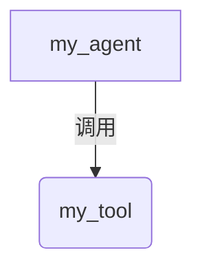

# ADK 样例创建器

本技能帮助你为 ADK Python 仓库创建新样例。你应当搜索 `contributing` 下的子目录（例如 `new_workflow_samples`、`workflow_samples` 等），并在创建样例前与用户确认他们想使用哪个文件夹。

> [!TIP]

> 创建样例之前，你可以使用 `adk-style` 技能了解 ADK 2.0 架构知识与最佳实践。

一个样例由以下部分组成：

1.  每个样例一个目录。
2.  一个定义代理或工作流逻辑的 `agent.py` 文件。
3.  一个说明该样例的 `README.md` 文件。

## 指导原则

### 1. 文件夹名称

文件夹名使用 snake_case（例如 `dynamic_nodes`、`fan_out_fan_in`）。

### 2. `agent.py` 内容

`agent.py` 应专注于演示某个特定特性或代理模式。为便于测试，请使用绝对导入。

> [!IMPORTANT]
> **模型选择**：不要在样例代理中的 `Agent` 实例上显式设置 `model` 参数（例如 `model="gemini-2.5-flash"`）。除非用户明确要求使用某个特定模型，否则应让它们默认使用系统配置的模型。

请从以下模式中选择一种：

#### 模式 A：工作流（用于复杂图）

当你需要多个节点、路由或并行执行时使用此模式。

**导入：**

```python
from google.adk import Agent
from google.adk import Context
from google.adk.workflow import node
from google.adk.workflow import JoinNode
from google.adk.workflow._workflow_class import Workflow
```

**结构：**

```python
my_agent = Agent(name="my_agent", ...)

@node()
async def my_node(node_input: str):
    return "result"

root_agent = Workflow(
    name="root_wf",
    edges=[("START", my_node)],
)
```

#### 模式 B：独立代理（用于单代理或简单工具调用）

当你不需要图，且由代理自行处理循环时使用此模式。

**导入：**

```python
from google.adk import Agent
from google.adk.tools import google_search  # 示例
```

**结构：**

```python
root_agent = Agent(
    name="standalone_assistant",
    instruction="你是一个乐于助人的助手。",
    description="一个可以协助处理各类查询的助手。",
    tools=[google_search],
)
```

### 3. `README.md` 内容

每个样例都应有一个 `README.md`，其结构如下：

- **概述**：该样例做什么。
- **样例输入**：用于测试的输入示例。每个提示词都必须用反引号包裹。如果某个提示词带有说明，务必在提示词与说明之间加一个空行，并将说明缩进两个空格。
- **图**：图流程的可视化（推荐使用 Mermaid）。对于 Workflow 根代理，可视化节点的图流程。对于编排工具或子代理的代理（例如 `LlmAgent`、`ManagedAgent`），应可视化该代理及其工具/子代理的拓扑结构，而不是内部工作流节点。保持为简单的拓扑图（少量节点和边）。**不要**绘制请求/响应数据流序列（例如 `user -> agent -> API -> tool -> ... -> user`）；这类图既杂乱，相比拓扑图也提供不了多少价值。
- **使用方法**：说明所使用的关键技术（例如 `ctx.run_node`）。
- **相关指南**：指向 `docs/guides/` 中解释所用概念或类的相关开发者指南的链接。

#### README 示例模板：

````markdown
# ADK 样例名称

## 概述

简要描述。

## 样例输入

- `提示词示例 1`

- `提示词示例 2`

  *说明或预期行为*

## 图

对于 Workflow 根代理：


对于编排工具或子代理的代理（`LlmAgent`、`ManagedAgent` 等）：


## 使用方法

解释细节。

## 相关指南

- [指南标题](../../docs/guides/path/to/guide.md) - 说明该指南涵盖内容的简要描述。
````

## 示例

### 动态节点
来自 `dynamic_nodes/agent.py` 的代码片段：
```python
@node(rerun_on_resume=True)
async def orchestrate(ctx: Context, node_input: str) -> str:
    while True:
        headline = await ctx.run_node(generate_headline)
        # ...
````

### 扇出扇入

来自 `fan_out_fan_in/agent.py` 的代码片段：

```python
root_agent = Workflow(
    name="root_agent",
    edges=[("START", (node_a, node_b), join_node, aggregate)],
)
```
