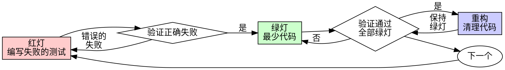

# 测试驱动开发（TDD）

## 概述

先写测试。看它失败。写最少的代码让它通过。

**核心原则：** 如果你没有看到测试失败，你就不知道它是否测试了正确的东西。

**违反规则的字面意思就是违反规则的精神。**

## 何时使用

**始终使用：**
- 新功能
- Bug 修复
- 重构
- 行为变更

**例外（需询问你的人类伙伴）：**
- 一次性原型
- 生成的代码
- 配置文件

想着"就这一次跳过 TDD"？停下来。那是在给自己找借口。

## 铁律

```
没有失败的测试，就不写生产代码
```

先写了代码再写测试？删掉它。从头来过。

**没有例外：**
- 不要保留作为"参考"
- 不要在写测试时"改编"它
- 不要看它
- 删除就是删除

从测试出发，重新实现。句号。

## 红-绿-重构



### 红灯 - 编写失败的测试

写一个最小的测试来展示期望行为。

<Good>
```typescript
test('retries failed operations 3 times', async () => {
  let attempts = 0;
  const 操作 = () => {
    attempts++;
    if (attempts < 3) throw new Error('fail');
    return 'success';
  };

  const result = await retryOperation(操作);

  expect(result).toBe('success');
  expect(attempts).toBe(3);
});
```
名称清晰，测试真实行为，只测一件事
</Good>

<Bad>
```typescript
test('retry works', async () => {
  const mock = jest.fn()
    .mockRejectedValueOnce(new Error())
    .mockRejectedValueOnce(new Error())
    .mockResolvedValueOnce('success');
  await retryOperation(mock);
  expect(mock).toHaveBeenCalledTimes(3);
});
```
名称模糊，测试的是 mock 而非代码
</Bad>

**要求：**
- 一个行为
- 清晰的名称
- 使用真实代码（除非不得已才用 mock）

### 验证红灯 - 看它失败

**必须执行。绝不跳过。**

```bash
npm test path/to/test.test.ts
```

确认：
- 测试失败（不是报错）
- 失败信息符合预期
- 失败原因是功能缺失（不是拼写错误）

**测试通过了？** 你在测试已有的行为。修改测试。

**测试报错了？** 修复错误，重新运行直到它正确地失败。

### 绿灯 - 最少代码

写最简单的代码让测试通过。

<Good>
```typescript
async function retryOperation<T>(fn: () => Promise<T>): Promise<T> {
  for (let i = 0; i < 3; i++) {
    try {
      return await fn();
    } catch (e) {
      if (i === 2) throw e;
    }
  }
  throw new Error('unreachable');
}
```
刚好够通过测试
</Good>

<Bad>
```typescript
async function retryOperation<T>(
  fn: () => Promise<T>,
  options?: {
    maxRetries?: number;
    backoff?: 'linear' | 'exponential';
    onRetry?: (attempt: number) => void;
  }
): Promise<T> {
  // YAGNI
}
```
过度设计
</Bad>

不要添加功能、重构其他代码或做超出测试要求的"改进"。

### 验证绿灯 - 看它通过

**必须执行。**

```bash
npm test path/to/test.test.ts
```

确认：
- 测试通过
- 其他测试仍然通过
- 输出干净（没有错误、警告）

**测试失败了？** 修改代码，不是测试。

**其他测试失败了？** 立即修复。

### 重构 - 清理代码

只有在绿灯之后才重构：
- 消除重复
- 改善命名
- 提取辅助函数

保持测试绿灯。不要添加行为。

### 重复

为下一个功能写下一个失败的测试。

## 好的测试

| 特质 | 好的 | 差的 |
|------|------|------|
| **最小化 ** | 只测一件事。名称中有"和"？拆分它。 | `test ('验证电子邮件、域和空格')` |
| * *清晰 * * | 名称描述行为 | `test (' test1 ')` |
| * *展示意图 * * | 展示期望的 API | 掩盖了代码应该做什么 |

## 为什么顺序很重要

**"我先写完再补测试来验证"**

后写的测试立即通过。立即通过什么也证明不了：
- 可能测试了错误的东西
- 可能测试的是实现而非行为
- 可能遗漏了你忘掉的边界情况
- 你从未看到它捕获 bug

先写测试迫使你看到测试失败，证明它确实在测试某些东西。

**"我已经手动测试了所有边界情况"**

手动测试是临时的。你以为你测试了所有情况，但是 ：
- 没有测试记录
- 代码变更后无法重新运行
- 在压力下容易遗忘
- "我试过了能跑" 不等于 全面测试

自动化测试是系统性的。它们每次以相同方式运行。

* * "删除X小时的工作太浪费了" *