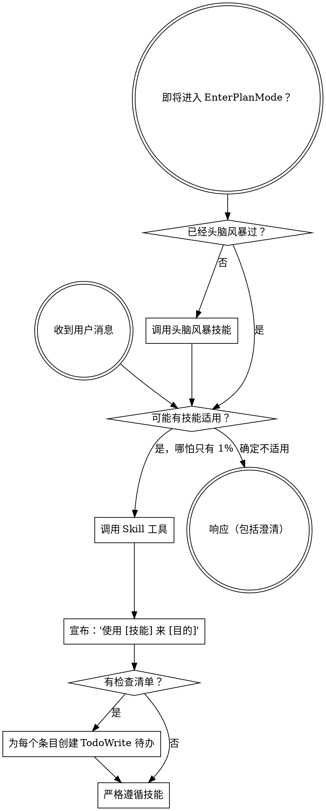

<SUBAGENT-STOP>
如果你是作为子智能体被分派来执行特定任务的，跳过此技能。
</SUBAGENT-STOP>

<EXTREMELY-IMPORTANT>
如果你认为哪怕只有 1% 的可能性某个技能适用于你正在做的事情，你绝对必须调用该技能。

如果一个技能适用于你的任务，你没有选择。你必须使用它。

这不可协商。这不是可选的。你不能通过合理化来逃避。
</EXTREMELY-IMPORTANT>

## 指令优先级

Superpowers 技能覆盖默认系统提示行为，但**用户指令始终具有最高优先级**：

1. **用户的明确指令**（CLAUDE.md、GEMINI.md、AGENTS.md、直接请求）——最高优先级
2. **Superpowers 技能** ——在冲突处覆盖默认系统行为
3. **默认系统提示** ——最低优先级

如果 CLAUDE.md、GEMINI.md 或 AGENTS.md 说"不要使用 TDD"，而某个技能说"始终使用 TDD"，遵循用户的指令。用户拥有控制权。

## 如何访问技能

**在 Claude Code 中：** 使用 `Skill` 工具。当你调用一个技能时，其内容会被加载并呈现给你——直接遵循即可。绝不要用 Read 工具读取技能文件。

**在 Copilot CLI 中：** 使用 `skill` 工具。技能从已安装的插件中自动发现。`skill` 工具的工作方式与 Claude Code 的 `Skill` 工具相同。

**在 Hermes Agent 中：** 使用 `skill_view` 工具加载技能。Hermes 支持三级渐进式加载：`skills_list` 浏览 → `skill_view(name)` 加载完整内容 → `skill_view(name, path)` 查看引用文件。

**在 Gemini CLI 中：** 技能通过 `activate_skill` 工具激活。Gemini 在会话开始时加载技能元数据，并按需激活完整内容。

**在其他环境中：** 查看你的平台文档了解技能的加载方式。

## 平台适配

技能使用 Claude Code 的工具名称。非 CC 平台：查看 `references/copilot-tools.md`（Copilot CLI）、`references/hermes-tools.md`（Hermes Agent）、`references/codex-tools.md`（Codex）、`references/qoder-tools.md`（Qoder）了解工具对应关系。Gemini CLI 用户通过 GEMINI.md 自动获得工具映射。

# 使用技能

## 规则

**在任何响应或操作之前调用相关或被请求的技能。** 哪怕只有 1% 的可能性某个技能适用，你都应该调用该技能来检查。如果调用后发现技能不适合当前情况，你不需要使用它。

## 红线

这些想法意味着停下——你在合理化：

| 想法 | 现实 |
