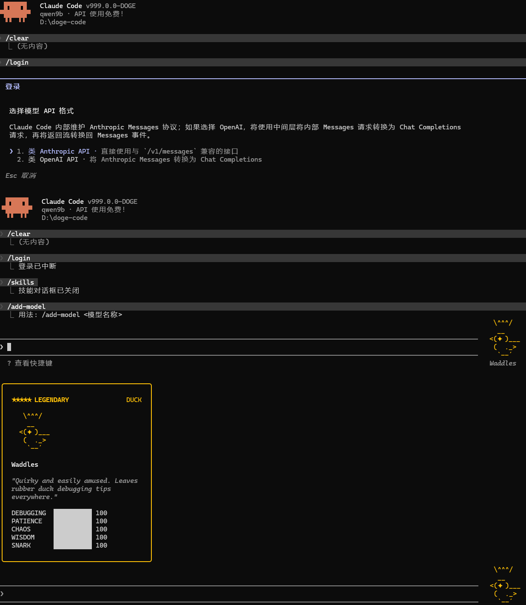

# Doge Code

> Claude Code 分支克隆后，不断试错，不断回退，逐步汉化，还在进行中的一个项目。纯粹就是为了好用，贴地好用。

[](README.md)
[](README.md)
[](README.md)
[](README.md)
[](README.md)
[](README.md)



## 这是什么

[`Doge Code`](README.md) 基于一份还原后的 [`Claude Code`](README.md) 源码树继续修改而来。

可以把它理解为：
  缝合怪+汉化版。
  
## 主要记录：
1、破除限制：官方对订阅用户有很多特权，通讯交流时无延迟，MPC支持，对兼容方式和非官方订阅都有很多限制，破除。
2、汉化：很多文件都通过2026年4月份放开试用的QWen Coder进行汉化，保证基本汉化质量，对于后续汉化不彻底的地方试用DeepSeek官方网页进行汉化。
3、定制：代码对状态栏进行了扩展，token进出已进行严密监控。
4、模型切换：自由切换不同厂家大模型的baseURL及APIKEY以及模型等，按照项目文件夹进行记录，低级项目试用普通本地部署，关键步骤试用云端。
5、可编译为可执行程序，方便切换到其他平台。
6、作者实际使用，并不断改进种，有使用问题及空闲时间，可参数本项目。
7、技能等开源内容，官方升级后，本系统也将升级，吸收官方可采纳的优秀功能。
8、由于可以直接使用链接，因此不再依赖ccswitch造成无谓的时间浪费和CPU算力消耗。
9、伙伴系统也移植到了系统，满级，满属性，稀有。
10、提示词全中文后，进行了精简，一连串没有意义的废话，发送一次请求包就要10K起步。中文提示词配合中文模型编程效率翻倍。
11、任务结束时，声音提醒，官方暂无此功能。


## 使用心得：
1、一个请求处理完毕后，没必要再继续时，/clear重新会话，减少上下文，清洗大模型脑子。
2、使用遇到大模型逼逼叨叨反反复复的情况，中断任务，新开会话。
3、复杂事务处理应分阶段，分难度，子代理功能官方有问题，已修复。
4、没事别和大模型絮叨或者你好啥的，它就是没有灵魂的数字。
5、提示词精准，切中要害，多用限制词：必须、一定，务必这种。
6、将稍微复杂的事务处理完毕后，可以考虑叫大模型总结一个技能。
7、即时在状态栏查看token消耗。
8、及时禁用、启用插件，清理没用的技能，及时提交项目至云端，方便回溯。
9、首次提交到github.com时，务必记得忽略规则文件中将.doge/目录排除，以防APIKEY公布。


## 常用命令：
/login 切换不同BaseURL，APIKEY,模型。
/clear 清空上下文，相当于退出软件再进入
/plugins 管理插件
/skills 管理技能
/agents 管理代理
/compact 压缩会话内容，减少token消耗。
/context 查看上下文用量
/rewind 或者两次ESC,相当于上下文回滚到指定轮次。
/resume 恢复选定的会话。
/rename 命名会话方便记忆。
/model 切换当前使用的模型为新模型
/cost 计费情况查看，待完善。
/plan 或者Shift+Tab 两次进入计划模式。
/init 重新审视项目，更新CLAUDE.md文件。
/stock 股票查询（行情、财务、指标、自选股管理）
/sessions 多会话管理（新建、切换、统计、删除）
/diagnose 系统环境诊断（环境、系统、依赖、配置）
/workspace 工作区管理（保存、加载、列表、统计）
/memory-search 记忆搜索（全文搜索、标签过滤、统计）
/diff-mode 差异视图（对比文件、目录、Git变更）
/autocomplete 智能补全（命令、Git分支、文件路径）
/release-notes 发布说明（Changelog生成、版本对比）
/bughunter Bug猎人（代码扫描、模式检测、快速检查）
/rules 持久化规则管理（创建、编辑、查看跨会话规则）
/dashboard 用量仪表盘（Web界面统计、费用、用量分析）

## 核心功能特性（特性吸收计划产物）

本项目在基础 CLI 之上，吸收仿照业界优秀编程代理功能，集成了一批扩展能力（部分命令）：

| 功能 | 命令 | 说明 |
|------|------|------|
| 并排 Diff 视图 | `/diff-mode` | GitHub 风格左右对照 diff |
| 块状结构化输出 | `/block-mode` | Bash/工具输出独立边框可折叠块 |
| Repo Map 代码库映射 | `/repo-map` | 目录结构 + 符号分组 AI 摘要 |
| 多会话/多 Tab 管理 | `/sessions` | 类似 tmux 的多会话切换 |
| 浏览器自动化 | `/browser` | Playwright 网页调试/E2E 测试 |
| 代码库向量搜索 | `/vector-search` | SQLite FTS5 + BM25 全库搜索（零外部依赖）|
| Git 工作流深度集成 | `/commit-push-pr` | AI 生成 commit message + 推送 + PR |
| 代码搜索增强 | `/code-search` | 正则 + 语义 + 混合 + 符号四模式 |
| 超长上下文 | Gemini 1M/2M、Opus 1M | 支持百万级 token 上下文窗口 |
| Docker 沙箱隔离 | 内置 | 在容器内执行命令，隔离工作环境 |
| AI 测试生成 | `/test-gen` | 自动生成测试并运行，失败自动修复（最多5轮）|
| 安全扫描 | `/security-audit`（别名 `/audit`、`/sast`）| 检测 SQL 注入、XSS、硬编码密钥等 |
| 多 Agent 协作 | `/agents` + AgentTool | 多专用子代理协作（规划/探索/执行/审查）|

> 说明：完整实现细节见仓库 `CLAUDE.md` 的"核心功能区"章节。

## 智能工作流与预测性助手（桌面端）

Doge Code 桌面端（Electron GUI）集成了智能工作流系统，能够根据当前工作状态自动调整界面，并提供预测性建议和操作回滚能力。

### 一、智能上下文工作流

系统根据当前上下文自动切换工作模式，无需手动切换面板：

| 模式 | 触发条件 | 自动调整 |
|------|----------|----------|
| **编码模式** | 选择 `.ts`/`.py` 等代码文件 | 打开 MonacoEditor + ToolPanel，底栏显示 Terminal |
| **调试模式** | 检测到 `Error:`/`Traceback:` 等错误 | 右侧切换 Debugger + Terminal |
| **审查模式** | 检测到 Git 代码变更 | 右侧切换 GitDiff + ReviewPanel |
| **项目管理** | 检测到 `TODO`/任务描述 | 右侧切换 Kanban + TimeTracker |

**使用方法：**
- 打开文件时自动进入编码模式
- 代码有 Git 变更时自动进入审查模式
- 检测到错误时自动进入调试模式
- 点击右上角模式指示器可手动锁定/解锁模式
- 锁定后不会自动切换，避免干扰

### 二、预测性 AI 助手

系统对当前文件进行轻量静态分析，在消息流中展示智能建议：

**支持的检测类型：**
- 🔍 **待办标记** — 检测 TODO/FIXME/HACK/XXX/OPTIMIZE 等标记
- 📏 **长函数** — 检测超过 80 行的函数，建议拆分
- 📋 **重复代码** — 检测重复代码块，建议提取为公共函数
- 🌀 **复杂嵌套** — 检测超过 4 层的嵌套，建议简化逻辑
- ⚠️ **废弃 API** — 检测 componentWillMount 等废弃 API 使用

**使用方法：**
- 打开文件后自动分析，建议显示在消息流中
- 点击建议可查看详情
- 点击 "✕" 可忽略单条建议
- 点击 "全部忽略" 可清除所有建议
- 分析结果仅前端 regex 检测，不调用 AI API，无额外费用

### 三、操作快照 + 一键回滚

所有文件编辑操作自动记录快照，支持一键回滚到操作前状态：

**快照机制：**
- 文件编辑（WriteTool/Edit/MultiEdit）自动记录 before/after 快照
- 快照保存最近 1 小时的操作记录
- 支持回滚到任意操作前的状态

**使用方法：**
- 点击右上角 "📜 历史" 按钮打开操作历史面板
- 面板显示所有文件编辑操作的时间、工具、文件列表
- 点击 "↩ 回滚" 按钮可恢复到操作前状态
- 回滚后状态显示为 "已回滚"
- 点击 "清除全部" 可清空历史记录

**注意事项：**
- 回滚会覆盖当前文件内容，请确认后再操作
- 快照仅保存文件内容，不保存 git 状态
- 建议重要操作前先提交 git，以便双重保障

## 新增功能（竞品对标补完 — 2026-08-04）

Doge Code 持续对标业界主流编程智能体（Cursor、Copilot、Cline、Aider、Windsurf 等），补完以下关键能力。

### 一、持久化规则系统 (.dogerules)

类似 Cursor 的 `.cursorrules`，提供跨会话的持久化指令能力。支持三级规则加载（后者优先级更高）：

| 级别 | 文件路径 | 说明 |
|------|----------|------|
| **全局规则** | `~/.dogerules` | 适用于所有项目的私有规则 |
| **项目规则** | `./.dogerules` | 签入代码库的团队规则 |
| **本地规则** | `./.dogerules.local` | 个人项目规则（gitignore） |

**使用方法：**
```
/rules init              # 创建项目规则文件
/rules add 使用2空格缩进  # 添加规则
/rules add 提交前必须运行测试
/rules show               # 查看规则详情
/rules list               # 列出所有规则
/rules edit # 新规则内容  # 替换整个规则文件
/rules remove 2           # 删除第2行规则
/rules clear              # 清空项目规则
```

**规则示例：**
```markdown
# 编码规范
- 代码风格使用 2 空格缩进
- 提交前必须运行测试
- 使用 TypeScript 而非 JavaScript
- 优先使用函数式编程风格

# 项目约定
- API 路由使用 RESTful 规范
- 数据库查询使用 Prisma ORM
- 日志使用 pino 库
```

**技术实现：**
- 规则在会话启动时自动注入系统提示（通过 `appendSystemPrompt`）
- 支持 CLI（`main.tsx`）和桌面端（`prompts.ts`）双入口
- 优先级：本地 > 项目 > 全局
- 实现位置：`src/utils/dogerules.ts`（加载/格式化）、`src/commands/rules/index.ts`（命令）

### 二、用量分析仪表盘 (/dashboard)

Web 可视化仪表盘，实时展示用量统计和费用分析。

**使用方法：**
```cmd
/dashboard open           # 启动仪表盘（浏览器访问 http://127.0.0.1:3456）
/dashboard stop           # 停止仪表盘
/dashboard status         # 查看当前统计
/dashboard export         # 导出数据到 JSON
/dashboard reset          # 重置统计数据
```

**仪表盘功能：**
- 📊 **总体统计** — 总费用、总 Token、缓存命中、代码变更、运行时长
- 🤖 **按模型统计** — 各模型的 Token 用量和费用占比
- 📈 **每日趋势** — 按天统计的使用量变化
- 🔄 **自动刷新** — 每 30 秒自动更新数据

**API 端点：**
- `GET /` — Web 仪表盘界面（HTML）
- `GET /api/stats` — JSON 格式统计数据
- `GET /api/health` — 健康检查

**技术实现：**
- HTTP 服务器：`src/services/dashboard/server.ts`
- 数据聚合：`src/services/dashboard/api.ts`
- 数据类型：`src/services/dashboard/types.ts`
- 费用追踪：集成 `cost-tracker.ts` 和 `cost-database.ts`

### 三、IDE 扩展

Doge Code 提供 VS Code 扩展和 JetBrains 插件，让开发者可以在 IDE 中直接使用 AI 能力。

#### VS Code 扩展

**安装：**
```bash
cd vscode-extension
npm install
npm run compile
# 在 VS Code 中按 F5 启动调试
```

**功能：**
- 🐕 AI 聊天面板 — 在 VS Code 中与 Doge Code 对话
- 📊 用量统计 — 实时查看费用和 Token 用量
- ⚙️ 配置面板 — 自定义服务器地址和功能开关

**命令：**
- `Doge Code: 打开聊天` — 打开聊天面板
- `Doge Code: 显示用量统计` — 显示费用统计

**配置项：**
```json
{
  "doge-code.serverUrl": "http://127.0.0.1:3456",
  "doge-code.enableChat": true,
  "doge-code.enableAutocomplete": false
}
```

#### JetBrains 插件

**构建：**
```bash
cd jetbrains-plugin
./gradlew buildPlugin
```

**功能：**
- 🐕 侧边栏聊天窗口 — 在 JetBrains IDE 中与 Doge Code 对话
- 📊 用量统计 — 查看费用和 Token 用量
- ⚙️ 设置面板 — 配置服务器地址

**支持 IDE：**
- IntelliJ IDEA、PyCharm、WebStorm、PhpStorm、RubyMine、CLion、GoLand、Rider 等

### 四、代码质量改进

#### 已修复的 TypeScript 错误

| 文件 | 错误类型 | 修复方式 |
|------|----------|----------|
| `strategy-examples.ts` | 字符串字面量 | 修复数组分隔符 |
| `proactive.ts` | 导入路径 + async | 修正导入 + 添加 async |
| `workflow.test.ts` | Mock 类型不完整 | 添加 streamMessage/healthCheck |
| `QueryEngine.test.ts` | 属性不存在 | 改用 getState() |
| `AppStore.test.ts` | 属性不存在 | 改用实际属性 |
| `ToolRegistry.test.ts` | 参数缺失 | 添加第三个参数 |
| `sessionDiscovery.ts` | 类型不匹配 | 添加类型断言 |
| `auth.ts` | 未知类型 | 添加类型断言 |
| `assistant/assistant.ts` | 类型未导入 | 添加 Command 导入 |
| `loop/index.tsx` | 字符串跨行 | 改用 \n 转义 |
| `bridge/bridgeConfig.ts` | 返回类型 | 改用 \|\| 和类型断言 |
| `bridge/bridgeMessaging.ts` | 4处类型错误 | 添加类型断言 |
| `auto-wrapper.ts` | Cookie 类型 | 改用 as any |

#### 构建状态

- ✅ `bun run build` — 编译通过
- ✅ VS Code 扩展 — 编译通过
- ✅ 新功能测试 — 全部通过

### 五、故障排除

#### 规则系统问题

| 问题 | 解决方案 |
|------|----------|
| 规则未生效 | 检查 `.dogerules` 文件是否在项目根目录 |
| 规则冲突 | 本地规则优先级最高，检查 `.dogerules.local` |
| 规则格式错误 | 使用 Markdown 格式，每行一条规则 |

#### 仪表盘问题

| 问题 | 解决方案 |
|------|----------|
| 无法启动 | 检查端口 3456 是否被占用 |
| 无法连接 | 先运行 `/dashboard open` 启动服务器 |
| 数据为空 | 需要开始对话后才有统计数据 |
| 端口被占用 | 修改 `src/services/dashboard/server.ts` 中的端口号 |

#### IDE 扩展问题

| 问题 | 解决方案 |
|------|----------|
| VS Code 扩展无法编译 | 运行 `npm install` 安装依赖 |
| 无法连接到服务器 | 检查 `doge-code.serverUrl` 配置 |
| JetBrains 插件构建失败 | 确保已安装 Gradle 和 JDK 17+ |

### 六、更新日志

#### v19.0 (2026-08-04)

**新增功能：**
- ✨ 持久化规则系统 (.dogerules)
- ✨ 用量分析仪表盘 (/dashboard)
- ✨ VS Code 扩展
- ✨ JetBrains 插件

**代码质量：**
- 🔧 修复 13 个文件的 TypeScript 错误
- 🔧 修复 `bridge/bridgeConfig.ts` 返回类型问题
- 🔧 修复 `bridge/bridgeMessaging.ts` 类型错误
- 🔧 修复 `loop/index.tsx` 字符串字面量问题
- 🔧 修复 `auth.ts` 类型断言问题

**测试：**
- ✅ 规则系统功能测试通过
- ✅ 仪表盘 API 测试通过
- ✅ 仪表盘服务器启动测试通过
- ✅ VS Code 扩展编译通过
- ✅ 主项目构建通过

如果用 ACG 比喻，大概属于：

- 原作：[`Claude Code`](README.md)
- 本作：[`Doge Code`](README.md)

## 当前定位

这个仓库当前强调的是以下方向：

- 支持自定义 Anthropic 兼容接口地址
- 已经加入多入口的 OpenAI Chat Completions ↔ Anthropic Messages 转接能力
- 支持自定义 API Key
- 支持自定义模型与模型列表管理
- 尽量把自定义接入数据记录到项目下[`./.doge`](README.md) 路径体系
- 在保留 CLI/TUI 主体结构的前提下，无视登录流的绑定

换句话说，它现在更像一个“可自托管 / 可代理 / 可转接”的 [`Claude Code`](README.md) 变体。

## 与原版 Claude Code 的数据隔离

[`Doge Code`](README.md) 默认**不应**与原版 [`Claude Code`](README.md) 共用配置和缓存目录。

当前 Fork 已明确把默认用户目录收口到：

- 配置目录：[`~/.doge`](README.md)
- 全局配置文件：[`~/.doge/.claude.json`](README.md)
部分配置依旧使用官方的配置。

如果用户以前装过原版 [`Claude Code`](README.md)，再运行 [`Doge Code`](README.md) 时出现“明明没这么配却读到了旧配置”的现象，通常就是历史数据混用导致的。

建议：

- 原版继续使用它自己的 [`.claude`](README.md) / [`.claude.json`](README.md)
- [`Doge Code`](README.md) 使用 [`.doge`](README.md) 目录
- 如需手动指定，也可以通过 [`CLAUDE_CONFIG_DIR`](README.md) 为 [`Doge Code`](README.md) 指向独立目录

## OpenAI 兼容接口说明

[`Doge Code`](README.md) 正在加入一个“中间转接层”模式，用来让内部仍按 Anthropic Messages 结构工作的主逻辑，转发到 OpenAI Chat Completions 接口。

## 和原始还原仓库的关系

这个仓库**不是**上游官方源码Claude Code。

它有两层历史：

1. 第一层：还原后的源码树
2. 第二层：基于该源码树继续进行的 Fork 魔改
3、本项目：跟踪并吸纳官方闭源有用功能。

## 自动同步上游

仓库现在按 **Fork 常规同步** 的方式自动跟进上游，而不是把 [`main`](README.md) 做成裸镜像。

默认目标：

- 上游仓库：`https://github.com/HELPMEEADICE/doge-code.git`   截至今日已28天未更新，也就是从未更新。
- 上游分支：`main`
- 本仓库目标分支：`main`

如果你希望调整仓库或分支，可在 GitHub 仓库 Variables 里设置：

- `UPSTREAM_URL`
- `UPSTREAM_BRANCH`
- `TARGET_BRANCH`

注意：

- 这属于 Fork 常规同步，不会主动抹掉仓库里额外保留的工作流、脚本和发布配置
- 如果上游改动与你的 Fork 改动产生真实冲突，工作流会失败，需手动处理
- 仓库需要允许 Actions 具备 `contents: write` 权限，否则工作流无法推送
- 如果你以后要改成追更更上层仓库，例如 `anthropics/claude-code`，只需要改 `UPSTREAM_URL`

## 自动发布 npm

仓库现在也支持在同步成功后，基于当前 [`main`](README.md) 自动打包并发布你自己的 npm 包。

发布方式：

- 工作流：[`publish-npm.yml`](.github/workflows/publish-npm.yml)
- 打包脚本：[`prepare-release-package.mjs`](scripts/release/prepare-release-package.mjs)
- 启动包装器：[`claudex.js`](scripts/release/bin/claudex.js)

发布行为：

- 工作流在“同步上游”成功后触发，也支持手动触发
- 先准备一个专门用于发布的 `dist/npm/` 目录
- 把 `src`、`shims`、`vendor`、启动包装器以及发布所需元数据复制进去
- 发布版本号会基于源码里的版本号，再拼接当前提交短 SHA
- 同一提交只会发布一次，已存在的版本会自动跳过

 

可在 GitHub 仓库 Variables 里覆盖：

- `NPM_PACKAGE_NAME`
- `NPM_BIN_NAME`
- `PUBLISH_REPOSITORY_URL`

发布前提：

- 推荐在 npm 侧为这个仓库配置 Trusted Publishing；当前工作流已支持无 `NPM_TOKEN` 时自动走这条路径
- 如果你仍然想走传统 token，也可以配置 `NPM_TOKEN`
- 这个发布包是 “npm 分发 + Bun 运行” 模式，用户机器上仍需安装 Bun

安装与使用：

```windows cmd 中执行
install.bat     
complie.bat 
```
启动命令：d.bat  内有环境变量，自行设置。
如果编译有问题，可自行下载依赖包，或者留言。


## 当前状态

- 该源码树已经可以在本地开发流程中恢复并运行
- [`bun install`](README.md) 可用于安装依赖
- [`bun run dev`](README.md) 可用于启动恢复后的 CLI/TUI
- [`bun run version`](README.md) 可用于输出当前版本信息
- 项目已被继续改造成 [`Doge Code`](README.md) 分支，部分行为和 UI 已不再与原始 Claude Code 一致
- 部分区域仍保留恢复期 fallback，因此行为可能与上游实现不同
- OpenAI API 格式转接功能仍在开发中，当前并非完全稳定

## 为什么会有这个仓库
1、上游停止更新
2、基本没有中文编程沟通环境，中文严谨、单token携带的信息密度更高，可以在日常使用中节约更多token。
3、Claude Code对华政策令人不齿。
4、后续可能的情况下，脱离官方SDK支持。


## 运行方式

环境要求：

- Bun 1.3.5 或更高版本
- Node.js 24 或更高版本

安装依赖：

```bash
bun install
```

## 快速安装（推荐开发者直接源码使用）

如果你是直接拉这个仓库源码来用，最快的方式是用 安装依赖，编译成exe，复制或者设置PATH成为全局命令。

### 方式：源码目录内直接注册

在仓库根目录执行：

```bash
bun install
bun link
```

注册成功后：

- 全局包名是 [`@doge-code/cli`](package.json:2)
- 命令名是 [`doge`](package.json:24)

此后可直接运行，加入PATH环境变量后，配合每个项目的记录文件可以做到随意自由使用。

```bash
doge
```


## 使用 Git 直接源码级更新

这个 Fork 很适合直接通过 Git 拉取更新，而不是走传统已发布包升级。

典型更新流程：

```bash
git pull
bun install
bun link
```
由于对linux支持度降低，未做测试，请见谅。

含义分别是：

- [`git pull`](README.md)：拉取最新源码改动
- [`bun install`](README.md)：同步依赖变化
- [`bun link`](README.md)：刷新全局 link 注册，确保命令入口与当前源码一致

如果你本地就是长期用源码目录跑 [`Doge Code`](README.md)，这基本就是“源码级更新”的标准姿势。

### 一个推荐工作流

首次安装：

```bash
git clone <your-fork-or-repo-url>
cd doge-code
bun install
bun link
doge
```
或者  git clone <your-fork-or-repo-url>
cd doge-code
install.bat
complie.bat
d.bat

启动后设置环境变量，仔细利用大模型对代码进行改造。
也可复制doge到环境变量指向的任意位置后，使用doge 运行。


后续更新：

```bash
git pull
bun install
bun link
doge
```

## 命令与包名

运行 [`Doge Code`](README.md) CLI：

```bash
bun run dev
```

安装为全局命令后，默认命令名为：

```bash
doge
```

也就是说，这个 Fork 现在的目标入口名是 [`doge`](README.md)，而不是 [`claude`](README.md)。

如果你使用 [`bun link`](README.md) 进行全局注册链接，那么现在注册出来的包名也不再是原版名，而是：

```bash
@doge-code/cli
```

输出版本号：

```bash
bun run version
```

## 说明与免责声明

- 本仓库是 [`Claude Code`](README.md) 的 Fork：[`Doge Code`]的再次分叉。(README.md)
- 它包含恢复期代码与后续 Fork 改动，不代表官方立场
- 如果某些行为看起来“很像官方，但又不完全像”，那通常不是你看错了，而是这确实是恢复版 + 魔改版的叠加态 
