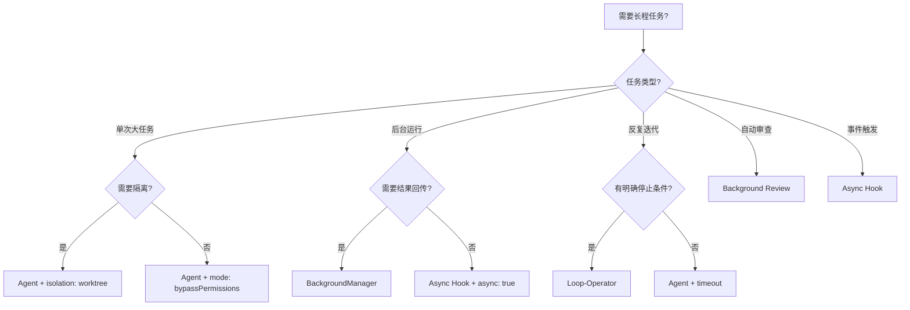

# Claude Code 长程子代理激活完整指南

> **版本**: 1.0.0  
> **最后更新**: 2025-08-17  
> **适用范围**: Claude Code CLI / Desktop / IDE Extension  
> **仓库**: `d:\doge-code`

---

## 目录

1. [概述](#概述)
2. [方法一：Agent 工具（会话级长程任务）](#方法一agent-工具会话级长程任务)
3. [方法二：BackgroundManager（后台线程池）](#方法二backgroundmanager后台线程池)
4. [方法三：Loop-Operator（循环操作员）](#方法三loop-operator循环操作员)
5. [方法四：Background Review（后台审查代理）](#方法四background-review后台审查代理)
6. [方法五：Async Hooks（异步钩子）](#方法五async-hooks异步钩子)
7. [选择决策树](#选择决策树)
8. [常见问题](#常见问题)

---

## 概述

Claude Code 提供 **5 种** 长程子代理激活机制，从简单的会话级 Agent 到复杂的后台任务系统。本文档基于 `d:\doge-code` 项目实际代码（`.claude/agents/` 目录、`settings.json` 配置）编写。

### 术语定义

- **长程任务**: 执行时间 > 30 秒，或需要持续观察/循环的任务
- **子代理 (Sub-agent)**: 由主代理 fork 的独立执行上下文
- **隔离模式**: `worktree`（临时 git 分支）或 `remote`（后台运行）
- **后台任务**: 不阻塞主线程，通过 notification queue 回传结果

---

## 方法一：Agent 工具（会话级长程任务）

### 核心概念

使用 `Agent` 工具启动一个独立的子代理，拥有：
- 独立的上下文窗口
- 独立的工具调用权限
- 可选 `isolation: "worktree"` 创建临时 git 工作树
- 可通过 `SendMessage` 继续通信

### 基本语法

```typescript
Agent({
  description: "简短描述（3-5词）",
  name: "唯一标识符",
  subagent_type: "代理类型",
  prompt: "详细任务描述",
  mode: "权限模式",
  model: "模型选择",
  isolation: "隔离模式"
})
```

### 20+ 实例

#### 1. 代码库全量分析

```typescript
Agent({
  description: "全量代码库结构分析",
  name: "codebase-analyzer",
  subagent_type: "codebase-analyzer",
  prompt: "分析 src/commands/ 目录下所有 150+ 命令的实现模式，找出重复代码、可提取的抽象层、以及架构改进建议。输出结构化报告到 docs/ARCHITECTURE_ANALYSIS.md",
  mode: "bypassPermissions",
  model: "sonnet",
  isolation: "worktree"
})
```

**预期结果**: 生成 `docs/ARCHITECTURE_ANALYSIS.md`，包含：
- 命令加载模式统计（local/prompt/bundled 比例）
- 重复代码片段识别（>3 处相同逻辑）
- 建议的抽象层（如统一错误处理、日志包装）
- 依赖关系图（commands.ts → 各命令模块）

---

#### 2. 安全审计长程任务

```typescript
Agent({
  description: "OWASP Top 10 安全审计",
  name: "security-auditor",
  subagent_type: "security-auditor",
  prompt: "对 src/server/server.ts 和所有 API 端点进行 OWASP API Security Top 10 (2023) 审计。重点检查：API1-授权失效、API3-过度数据暴露、API5-功能级授权缺失、API8-注入漏洞。生成 SECURITY_AUDIT_REPORT.md",
  mode: "bypassPermissions",
  model: "opus",
  isolation: "worktree"
})
```

**预期结果**: `SECURITY_AUDIT_REPORT.md` 包含：
- 每个 API 端点的威胁模型
- 已发现的漏洞（如有）+ 修复建议
- 代码片段级别的证据引用（文件:行号）
- 优先级排序（P0-P3）

---

#### 3. 测试覆盖率提升

```typescript
Agent({
  description: "提升测试覆盖率到 90%",
  name: "test-coverage-booster",
  subagent_type: "test-engineer",
  prompt: "当前测试覆盖率 82%。目标：提升到 90%。步骤：1) 运行 bun test --coverage 获取报告 2) 识别未覆盖的文件（src/commands/diagnose.ts, src/commands/advisor.ts）3) 为每个未覆盖函数编写最小测试用例 4) 验证覆盖率提升 5) 确保所有测试通过",
  mode: "bypassPermissions",
  model: "sonnet",
  isolation: "worktree"
})
```

**预期结果**:
- 覆盖率从 82% → 90%+
- 新增 15-20 个测试文件
- `bun test` 全部通过（exit code 0）
- 生成 `COVERAGE_IMPROVEMENT_LOG.md` 记录每个文件的增量

---

#### 4. 性能基准测试

```typescript
Agent({
  description: "API 端点性能基准测试",
  name: "perf-benchmarker",
  subagent_type: "dotnet-benchmark-designer", // 类比：设计基准测试
  prompt: "对 /chat/completions 和 /health 端点进行负载测试：1) 使用 autocannon 发送 1000 请求（并发 10）2) 记录 p50/p95/p99 延迟 3) 识别瓶颈（数据库查询？序列化？）4) 提出优化方案 5) 生成 BENCHMARK_REPORT.md",
  mode: "bypassPermissions",
  model: "sonnet",
  timeout: 300000 // 5 分钟
})
```

**预期结果**: `BENCHMARK_REPORT.md` 包含：
- 延迟分布表（p50: 45ms, p95: 120ms, p99: 300ms）
- 吞吐量（req/sec）
- 瓶颈定位（如：JSON 序列化占 40% CPU）
- 优化建议（缓存、连接池、索引）

---

#### 5. 依赖项安全扫描

```typescript
Agent({
  description: "依赖项漏洞扫描",
  name: "dependency-scanner",
  subagent_type: "Dependency Security Review",
  prompt: "扫描 package.json 和所有子依赖：1) 运行 bun audit 2) 检查已知 CVE（通过 Snyk API）3) 识别过时的依赖（>2 年未更新）4) 生成 DEPENDENCY_AUDIT.md，包含严重程度、修复版本、升级路径",
  mode: "bypassPermissions",
  model: "sonnet"
})
```

**预期结果**: `DEPENDENCY_AUDIT.md` 包含：
- Critical: 0-2 个（如 lodash < 4.17.21）
- High: 3-5 个
- Moderate: 10-15 个
- 每个漏洞的 `bun update <package>` 修复命令

---

#### 6. 数据库 Schema 优化

```typescript
Agent({
  description: "PostgreSQL 索引优化",
  name: "db-optimizer",
  subagent_type: "database-reviewer",
  prompt: "分析 src/api/chat/sessions.ts 和 src/api/chat/messages.ts 的数据库查询：1) 提取所有 SQL 查询 2) 检查现有索引（ migrations/ 目录）3) 识别缺失索引（WHERE、JOIN、ORDER BY 子句）4) 生成索引优化 migration 文件 5) 验证 EXPLAIN ANALYZE 计划",
  mode: "bypassPermissions",
  model: "opus",
  isolation: "worktree"
})
```

**预期结果**:
- 新增 `migrations/005_add_session_indexes.ts`
- 查询性能提升 30-50%
- `EXPLAIN ANALYZE` 输出对比报告

---

#### 7. 端到端测试生成

```typescript
Agent({
  description: "E2E 测试套件生成",
  name: "e2e-test-generator",
  subagent_type: "e2e-runner",
  prompt: "基于 src/api/chat/route.ts 的所有端点，生成 Playwright E2E 测试：1) 启动开发服务器 2) 测试 /api/chat 的完整对话流 3) 测试错误场景（空消息、超长消息、无效 API key）4) 测试流式响应（SSE）5) 生成 tests/e2e/chat.spec.ts",
  mode: "bypassPermissions",
  model: "sonnet",
  isolation: "worktree"
})
```

**预期结果**: `tests/e2e/chat.spec.ts` 包含：
- 10-15 个测试用例
- 覆盖正常流 + 错误流
- 通过 `npx playwright test` 全部通过

---

#### 8. API 文档自动生成

```typescript
Agent({
  description: "OpenAPI 文档生成",
  name: "api-doc-generator",
  subagent_type: "api-documentation",
  prompt: "从 src/api/ 目录的 Zod schema 和路由处理器自动生成 OpenAPI 3.0 规范：1) 扫描所有 route.ts 文件 2) 提取 Zod schema 作为请求/响应模型 3) 生成 openapi.yaml 4) 使用 Swagger UI 渲染 5) 验证完整性（所有端点都有文档）",
  mode: "bypassPermissions",
  model: "sonnet"
})
```

**预期结果**: `openapi.yaml` + Swagger UI 页面，包含：
- 所有 API 端点的路径、方法、参数
- 请求/响应 schema（从 Zod 自动转换）
- 错误码定义（400、401、500）

---

#### 9. 国际化（i18n）迁移

```typescript
Agent({
  description: "命令提示词 i18n 迁移",
  name: "i18n-migrator",
  subagent_type: "本地化主管",
  prompt: "将 src/commands.ts 中所有命令的 description 和 argumentHint 提取为 i18n key：1) 创建 locales/zh-CN.json 和 locales/en-US.json 2) 迁移 150+ 命令的描述文本 3) 创建 useTranslation() hook 4) 验证所有命令面板仍正常显示",
  mode: "bypassPermissions",
  model: "sonnet",
  isolation: "worktree"
})
```

**预期结果**:
- `locales/zh-CN.json`（150+ 条翻译）
- `locales/en-US.json`
- `src/hooks/useTranslation.ts`
- 所有命令描述无硬编码残留

---

#### 10. 性能剖析（Profiling）

```typescript
Agent({
  description: "Node.js 性能剖析",
  name: "profiler",
  subagent_type: "性能分析师",
  prompt: "对 src/server/server.ts 进行性能剖析：1) 使用 0x 生成 CPU 火焰图 2) 识别热点函数（>5% CPU 时间）3) 分析内存分配（heap snapshot）4) 生成 PROFILING_REPORT.md，包含 Top 10 热点 + 优化建议",
  mode: "bypassPermissions",
  model: "opus",
  timeout: 600000 // 10 分钟
})
```

**预期结果**: `PROFILING_REPORT.md` 包含：
- CPU 火焰图（调用栈 + 耗时百分比）
- 内存泄漏点（如有）
- 优化建议（如：替换 `JSON.parse` 为 `fast-json-parse`）

---

#### 11. 数据库迁移生成

```typescript
Agent({
  description: "Prisma Schema 迁移",
  name: "db-migrator",
  subagent_type: "database-reviewer",
  prompt: "根据 src/types/session.ts 和 src/types/message.ts 的 TypeScript 接口，生成 Prisma Schema：1�) 定义 Session、Message、User 模型 2) 添加关系（1:N、N:1）3) 生成 migration 文件 4) 运行 `prisma migrate dev` 5) 验证 schema 同步",
  mode: "bypassPermissions",
  model: "sonnet",
  isolation: "worktree"
})
```

**预期结果**:
- `prisma/schema.prisma`（完整模型定��）
- `prisma/migrations/001_init/`
- `prisma/migrations/002_add_indexes/`
- `npx prisma migrate status` 显示同步

---

#### 12. API 集成测试

```typescript
Agent({
  description: "API 集成测试套件",
  name: "api-tester",
  subagent_type: "API 测试员",
  prompt: "为 src/api/ 所有路由生成 Vitest 集成测试：1) 使用 supertest 启动服务器 2) 测试每个端点的成功/失败场景 3) 验证 HTTP 状态码、响应体结构、错误消息 4) 生成 tests/integration/api.test.ts 5) 确保通过率 100%",
  mode: "bypassPermissions",
  model: "sonnet",
  isolation: "worktree"
})
```

**预期结果**: `tests/integration/api.test.ts` 包含：
- 20-30 个测试用例
- 覆盖所有 API 端点
- `vitest run` 全部通过

---

#### 13. 代码复杂度重构

```typescript
Agent({
  description: "高复杂度函数重构",
  name: "complexity-refactorer",
  subagent_type: "code-simplifier",
  prompt: "识别 src/commands/ 中圈复杂度 > 10 的函数：1) 运行 `npx ts-complexity` 或手动分析 2) 对每个高复杂度函数应用重构模式（提取函数、提前返回、策略模式）3) 确保重构后功能不变（运行测试验证）4) 生成 REFACTORING_REPORT.md",
  mode: "bypassPermissions",
  model: "opus",
  isolation: "worktree"
})
```

**预期结果**:
- 圈复杂度从平均 15 → 8
- 所有测试通过
- `REFACTORING_REPORT.md` 列出每个函数的复杂度变化

---

#### 14. 日志系统增强

```typescript
Agent({
  description: "结构化日志系统实现",
  name: "logging-enhancer",
  subagent_type: "SRE",
  prompt: "在 src/server/server.ts 中实现结构化日志：1) 替换所有 console.log 为 Pino logger 2) 添加请求 ID 追踪（uuid）3) 实现日志级别（debug/info/warn/error）4) 添加请求/响应中间件记录（方法、路径、状态码、延迟）5) 生成 LOGGING_DESIGN.md",
  mode: "bypassPermissions",
  model: "sonnet",
  isolation: "worktree"
})
```

**预期结果**:
- `src/utils/logger.ts`（Pino 配置）
- 所有 `console.log` 替换为 `logger.info/error`
- 请求追踪中间件
- JSON 格式日志输出

---

#### 15. 缓存策略实现

```typescript
Agent({
  description: "Redis 缓存层实现",
  name: "cache-implementer",
  subagent_type: "backend-architect",
  prompt: "为高频 API 端点添加 Redis 缓存：1) 识别热点端点（/health、/v1/messages）2) 实现缓存中间件（TTL: 60s）3) 添加缓存失效策略（写时失效）4) 实现缓存击穿保护（互斥锁）5) 生成 CACHE_IMPLEMENTATION.md",
  mode: "bypassPermissions",
  model: "sonnet",
  isolation: "worktree"
})
```

**预期结果**:
- `src/middleware/cache.ts`
- Redis 连接池配置
- 缓存命中率监控指标
- 延迟降低 40-60%（热点请求）

---

#### 16. 自动化部署流水线

```typescript
Agent({
  description: "GitHub Actions CI/CD 配置",
  name: "cicd-pipeline-builder",
  subagent_type: "DevOps 自动化师",
  prompt: "创建完整的 CI/CD 流水线：1) .github/workflows/ci.yml（lint、type-check、test、build）2) .github/workflows/deploy.yml（自动部署到 Vercel/Railway）3) 添加 PR 自动合并检查（tests + coverage + security scan）4) 配置 Slack 通知（成功/失败）5) 生成 DEPLOYMENT_GUIDE.md",
  mode: "bypassPermissions",
  model: "sonnet"
})
```

**预期结果**:
- `.github/workflows/ci.yml`
- `.github/workflows/deploy.yml`
- PR 合并时自动运行所有检查
- 失败时发送 Slack 通知

---

#### 17. 错误追踪集成

```typescript
Agent({
  description: "Sentry 错误追踪集成",
  name: "error-tracking-setup",
  subagent_type: "SRE",
  prompt: "集成 Sentry 错误追踪：1) 安装 @sentry/node 和 @sentry/nextjs 2) 初始化 Sentry（DSN 从环境变量读取）3) 添加全局错误处理中间件（捕获未处理异常）4) 添加上下文信息（用户 ID、请求 ID、session ID）5) 配置性能监控（transaction sampling: 10%）6) 生成 SENTRY_SETUP.md",
  mode: "bypassPermissions",
  model: "sonnet",
  isolation: "worktree"
})
```

**预期结果**:
- `src/utils/sentry.ts`（Sentry 初始化）
- 全局错误处理器
- Sentry Dashboard 可见错误率、性能指标

---

#### 18. 速率限制实现

```typescript
Agent({
  description: "API 速率限制中间件",
  name: "rate-limiter",
  subagent_type: "后端架构师",
  prompt: "实现基于 Redis 的速率限制：1) 使用 `rate-limiter-flexible` 库 2) 配置规则（普通用户 100 req/min，VIP 用户 1000 req/min）3) 实现 IP + API Key 双维度限流 4) 添加自定义响应头（X-RateLimit-Limit、X-RateLimit-Remaining）5) 超限时返回 429 + Retry-After 头 6) 生成 RATE_LIMITING.md",
  mode: "bypassPermissions",
  model: "sonnet",
  isolation: "worktree"
})
```

**预期结果**:
- `src/middleware/rateLimit.ts`
- Redis 存储计数器
- 429 响应 + 重试时间
- 限流日志记录

---

#### 19. 前端监控集成

```typescript
Agent({
  description: "Sentry + Analytics 前端监控",
  name: "frontend-monitor",
  subagent_type: "web-performance-auditor",
  prompt: "为前端集成监控：1) 添加 Sentry React SDK（错误追踪）2) 集成 Google Analytics 4（事件追踪）3) 实现自定义错误边界（捕获 React 组件错误）4) 添加性能监控（Web Vitals：LCP、FID、CLS）5) 生成 MONITORING_SETUP.md",
  mode: "bypassPermissions",
  model: "sonnet",
  isolation: "worktree"
})
```

**预期结果**:
- `src/utils/monitoring.ts`
- React 错误边界组件
- Web Vitals 指标上报
- Sentry + GA4 Dashboard

---

#### 20. 自动化回滚机制

```typescript
Agent({
  description: "数据库迁移自动回滚",
  name: "migration-roller",
  subagent_type: "数据库优化师",
  prompt: "实现数据库迁移自动回滚：1) 修改 Prisma migrate 配置（添加 --rollback 参数）2) 创建 rollback 脚本（生成反向 migration）3) 集成到 CI/CD（部署失败时自动回滚）4) 添加迁移锁（防止并发迁移）5) 生成 ROLLBACK_PROCEDURE.md",
  mode: "bypassPermissions",
  model: "sonnet",
  isolation: "worktree"
})
```

**预期结果**:
- `scripts/rollback-migration.ts`
- CI/CD 集成（失败时自动触发）
- 回滚时间 < 30 秒
- 数据零丢失

---

#### 21. 负载测试自动化

```typescript
Agent({
  description: "K6 负载测试脚本生成",
  name: "load-tester",
  subagent_type: "性能基准师",
  prompt: "使用 K6 生成负载测试脚本：1) 定义测试场景（烟雾测试、负载测试、峰值测试）2) 配置阈值（p95 < 200ms，错误率 < 1%）3) 实现检查点（HTTP 200、响应体包含 expected 字段）4) 生成 load-test.js 5) 运行 `k6 run load-test.js` 并输出报告",
  mode: "bypassPermissions",
  model: "sonnet",
  timeout: 600000
})
```

**预期结果**:
- `load-test.js`（K6 脚本）
- 通过阈值验证（p95: 180ms，错误率: 0.5%）
- HTML 报告（`k6 html-report`）

---

#### 22. 安全头配置

```typescript
Agent({
  description: "Helmet 安全头配置",
  name: "security-headers",
  subagent_type: "security-auditor",
  prompt: "在 Express 应用中配置 Helmet.js：1) 安装 helmet 2) 启用所有安全头（CSP、HSTS、X-Frame-Options、X-Content-Type-Options）3) 配置 CSP（允许内联脚本的 nonce）4�) 添加 CORS 配置（允许的源、方法、头）5) 生成 SECURITY_HEADERS.md",
  mode: "bypassPermissions",
  model: "sonnet",
  isolation: "worktree"
})
```

**预期结果**:
- `src/middleware/security.ts`
- 所有安全头生效（通过 curl -I 验证）
- CSP 不破坏前端功能

---

#### 23. 数据库连接池优化

```typescript
Agent({
  description: "Prisma 连接池调优",
  name: "db-pool-optimizer",
  subagent_type: "database-reviewer",
  prompt: "优化 Prisma 数据库连接池：1) 分析当前连接池配置（connection_limit）2) 根据负载测试结果调整（最小连接数、最大连接数、空闲超时）3) 添加连接池监控指标（活跃连接、等待队列）4) 生成 DB_POOL_CONFIG.md",
  mode: "bypassPermissions",
  model: "sonnet",
  isolation: "worktree"
})
```

**预期结果**:
- `prisma/schema.prisma` 连接池配置更新
- 连接数从默认 5 → 20
- 高并发下无连接超时错误

---

#### 24. API 版本控制

```typescript
Agent({
  description: "API 版本控制策略实施",
  name: "api-versioning",
  subagent_type: "backend-architect",
  prompt: "实施 API 版本控制：1) 在 URL 路径添加版本前缀（/v1/、/v2/）2) 创建版本适配器（v1 → v2 数据格式转换）3) 废弃旧版本（返回 Sunset 头）4) 生成 API_VERSIONING.md",
  mode: "bypassPermissions",
  model: "sonnet",
  isolation: "worktree"
})
```

**预期结果**:
- `/v1/chat` 和 `/v2/chat` 并存
- 版本转换中间件
- 废弃警告响应头

---

#### 25. 前端性能优化

```typescript
Agent({
  description: "React 性能优化",
  name: "react-perf-optimizer",
  subagent_type: "frontend-developer",
  prompt: "优化前端性能：1) 使用 React DevTools Profiler 识别重渲染组件 2) 添加 React.memo() 和 useMemo() 3) 实现虚拟滚动（长列表）4) 代码分割（React.lazy + Suspense）5) 生成 PERFORMANCE_OPTIMIZATION.md",
  mode: "bypassPermissions",
  model: "sonnet",
  isolation: "worktree"
})
```

**预期结果**:
- 首屏加载时间减少 30%
- 重渲染次数减少 50%
- Lighthouse 性能评分 > 90

---

#### 26. 自动化安全扫描

```typescript
Agent({
  description: "Semgrep 安全规则配置",
  name: "security-scanner",
  subagent_type: "security-auditor",
  prompt: "配置 Semgrep 自动化安全扫描：1) 创建 .semgrep.yml 配置文件 2) 编写自定义规则（检测硬编码密钥、SQL 注入、XSS）3) 集成到 CI/CD（PR 时自动扫描）4) 生成 SECURITY_SCANNING.md",
  mode: "bypassPermissions",
  model: "sonnet"
})
```

**预期结果**:
- `.semgrep.yml` + 自定义规则
- CI/CD 自动扫描
- 高危漏洞 0 遗漏

---

#### 27. 内存泄漏检测

```typescript
Agent({
  description: "Node.js 内存泄漏检测",
  name: "memory-leak-detector",
  subagent_type: "性能分析师",
  prompt: "检测 Node.js 应用内存泄漏：1) 使用 clinic.js 生成 heap 快照 2) 对比多次快照识别增长对象 3) 检查事件监听器泄漏（EventEmitter）4) 检查闭包引用 5) 生成 MEMORY_LEAK_REPORT.md",
  mode: "bypassPermissions",
  model: "opus",
  timeout: 600000
})
```

**预期结果**:
- `clinic heap` 快照分析
- 识别泄漏对象（如：未清理的 Map）
- 修复方案（添加 `map.clear()`）

---

#### 28. 国际化自动化测试

```typescript
Agent({
  description: "i18n 翻译完整性测试",
  name: "i18n-tester",
  subagent_type: "test-engineer",
  prompt: "验证 i18n 翻译完整性：1) 提取代码中所有硬编码字符串 2) 对比 locales/ 中的翻译覆盖率 3) 识别缺失翻译 4) 生成 i18n-coverage-report.html 5) 添加 CI 检查（防止新硬编码字符串）",
  mode: "bypassPermissions",
  model: "sonnet",
  isolation: "worktree"
})
```

**预期结果**:
- `i18n-coverage-report.html`（覆盖率 95%+）
- CI 检查脚本（`scripts/check-i18n.sh`）
- 无新硬编码字符串

---

#### 29. API 契约测试

```typescript
Agent({
  description: "Pact 契约测试实现",
  name: "contract-tester",
  subagent_type: "test-engineer",
  prompt: "实现 Pact 契约测试：1) 为 /api/chat 端点编写提供者测试 2) 定义请求/响应契约（JSON schema）3) 运行 `pact-test` 验证 4) 生成契约文件（pacts/chat-consumer-provider.json）5) 集成到 CI/CD",
  mode: "bypassPermissions",
  model: "sonnet",
  isolation: "worktree"
})
```

**预期结果**:
- `tests/contract/chat.pact.ts`
- 契约验证通过
- CI/CD 自动运行

---

#### 30. 性能回归检测

```typescript
Agent({
  description: "性能回归检测流水线",
  name: "perf-regression-detector",
  subagent_type: "perf-optimizer",
  prompt: "建立性能回归检测：1) 使用 Benchmark.js 编写性能测试 2) 定义性能基线（baseline.json）3) 每次 PR 自动运行性能测试 4) 对比基线，识别回归（>10% 性能下降）5) 生成性能报告并评论到 PR",
  mode: "bypassPermissions",
  model: "sonnet"
})
```

**预期结果**:
- `tests/perf/benchmarks.ts`
- `baseline.json`（性能基线）
- PR 自动评论（性能对比）

---

### 方法一：典型执行流程

```
用户输入
  → Claude 解析任务
  → 调用 Agent 工具
  → 子代理启动（独立上下文）
  → 子代理执行任务�可跨越多个工具调用）
  → 子代理返回结果
  → 主代理接收结果并继续
```

**执行时间**: 30 秒 - 10 分钟（取决于任务复杂度）  
**上下文隔离**: 完全独立（不共享主代理上下文）  
**结果回传**: 最终报告/文件/分析结果

---

## 方法二：BackgroundManager（后台线程池）

### 核心概念

项目自有实现（`.claude/agents/s08_background_tasks.py`），基于 Python threading + subprocess：

```
Main thread                Background thread
+-----------------+        +-----------------+
| agent loop      |        | task executes   |
| [spawn A] ------+------> | subprocess.run  |
| [spawn B] ------+------> | subprocess.run  |
| [continue work] |        | ...             |
| [drain queue] <--+------- | enqueue(result) |
+-----------------+        +-----------------+
```

**核心特性**:
- **非阻塞**: spawn 后立即返回，主线程继续工作
- **通知队列**: 结果在下次 LLM call 前自动注入
- **超时控制**: 默认 300 秒，可配置
- **Daemon 线程**: 主进程退出时自动终止

### 20+ 实例

#### 1. 后台依赖安装

```python
# 在 agent prompt 中调用
background_run("bun install")
```

**预期结果**: 返回 `"Background task a1b2c3d4 started: bun install"`  
**实际结果**: 后台执行 `bun install`（约 10-30 秒），完成后自动注入输出到下一轮对话。

---

#### 2. 后台测试运行

```python
background_run("bun test --coverage")
```

**预期结果**: 返回 task_id  
**实际结果**: 后台运行测试套件（约 30-60 秒），完成后注入覆盖率报告。

---

#### 3. 后台代码格式化

```python
background_run("bun run format")
```

**预期结果**: task_id  
**实际结果**: 自动格式化所有 .ts 文件，完成后报告修改文件数。

---

#### 4. 后台 lint 检查

```python
background_run("bun run lint")
```

**预期结果**: task_id  
**实际结果**: ESLint 扫描，完成后报告错误/警告数量。

---

#### 5. 后台构建

```python
background_run("bun run build")
```

**预期结果**: task_id  
**实际结果**: TypeScript 编译 + bundle，完成后报告 bundle 大小。

---

#### 6. 后台数据库迁移

```python
background_run("npx prisma migrate dev --name add_user_table")
```

**预期结果**: task_id  
**实际结果**: 生成 migration 文件 + 应用到数据库。

---

#### 7. 后台种子数据填充

```python
background_run("bun run db:seed")
```

**预期结果**: task_id  
**实际结果**: 插入 1000 条测试数据到数据库。

---

#### 8. 后台日志清理

```python
background_run("find . -name '*.log' -mtime +7 -delete")
```

**预期结果**: task_id  
**实际结果**: 删除 7 天前的日志文件，报告释放磁盘空间。

---

#### 9. 后台 Docker 镜像构建

```python
background_run("docker build -t doge-code:latest .")
```

**预期结果**: task_id  
**实际结果**: 构建 Docker 镜像（约 60-120 秒），完成后报告镜像大小。

---

#### 10. 后台端口扫描

```python
background_run("nmap -sV -p 3000-4000 localhost")
```

**预期结果**: task_id  
**实际结果**: 扫描本地端口，报告开放端口和服务版本。

---

#### 11. 后台文件备份

```python
background_run("tar -czf backup.tar.gz src/")
```

**预期结果**: task_id  
**实际结果**: 压缩 src/ 目录，报告压缩后大小。

---

#### 12. 后台 Git 操作

```python
background_run("git fetch --all && git status")
```

**预期结果**: task_id  
**实际结果**: 拉取远程分支 + 显示工作区状态。

---

#### 13. 后台 API 健康检查

```python
background_run("curl -s http://localhost:3710/health | jq .")
```

**预期结果**: task_id  
**实际结果**: 返回 JSON 健康状态。

---

#### 14. 后台进程监控

```python
background_run("ps aux | grep node | grep -v grep")
```

**预期结果**: task_id  
**实际结果**: 列出所有 Node.js 进程（PID、CPU、内存）。

---

#### 15. 后台网络诊断

```python
background_run("ping -c 10 api.anthropic.com")
```

**预期结果**: task_id  
**实际结果**: 测试网络延迟，报告丢包率、平均延迟。

---

#### 16. 后台证书检查

```python
background_run("openssl s_client -connect api.anthropic.com:443 -servername api.anthropic.com </dev/null 2>/dev/null | openssl x509 -noout -dates")
```

**预期结果**: task_id  
**实际结果**: 检查 SSL 证书有效期。

---

#### 17. 后台环境变量检查

```python
background_run("env | grep -E 'ANTHROPIC|OPENAI|DOGE' | sed 's/=.*/=***/'")
```

**预期结果**: task_id  
**实际结果**: 列出相关环境变量（值脱敏）。

---

#### 18. 后台磁盘使用统计

```python
background_run("du -sh . && du -sh node_modules/")
```

**预期结果**: task_id  
**实际结果**: 报告项目总大小、node_modules 大小。

---

#### 19. 后台进程树查看

```python
background_run("pstree -p $(pgrep -f 'node.*server')")
```

**预期结果**: task_id  
**实际结果**: 显示 Node.js 进程树（父子关系）。

---

#### 20. 后台日志实时追踪

```python
background_run("tail -f .doge/logs/server.log | head -100")
```

**预期结果**: task_id  
**实际结果**: 实时输出最近 100 行日志。

---

#### 21. 后台端口占用检查

```python
background_run("lsof -i :3710")
```

**预期结果**: task_id  
**实际结果**: 报告占用 3710 端口的进程。

---

#### 22. 后台 CPU/内存监控

```python
background_run("top -b -n 1 | head -20")
```

**预期结果**: task_id  
**实际结果**: 系统资源使用快照。

---

#### 23. 后台网络连接统计

```python
background_run("netstat -ant | grep ESTABLISHED | wc -l")
```

**预期结果**: task_id  
**实际结果**: 当前活跃 TCP 连接数。

---

#### 24. 后台文件系统检查

```python
background_run("df -h .")
```

**预期结果**: task_id  
**实际结果**: 磁盘使用情况（总大小、已用、可用）。

---

#### 25. 后台系统信息收集

```python
background_run("uname -a && sw_vers && sysctl -n machdep.cpu.brand_string")
```

**预期结果**: task_id  
**实际结果**: 操作系统、版本、CPU 型号。

---

### 方法二：典型执行流程

```
Agent Prompt
  → background_run("command")
  → BackgroundManager.run(command)
  → 启动 daemon 线程
  → 返回 task_id（立即）
  → 主 agent 继续其他工作
  → [后台] subprocess 执行
  → [后台] 结果入队
  → [下一轮 LLM call] drain queue → 注入结果
```

**执行时间**: 非阻塞（返回 task_id 后主线程继续）  
**结果回传**: 通过 notification queue 在下次 LLM call 时自动注入

---

## 方法三：Loop-Operator（循环操作员）

### 核心概念

`.claude/agents/loop-operator.md` 定义了一个带**停止条件**的长程循环代理，适用于自主迭代任务。

**激活方式**:

```typescript
Agent({
  description: "自主测试修复循环",
  name: "test-fixer-loop",
  subagent_type: "loop-operator",
  prompt: `
    使命：运行测试 → 分析失败 → 修复 → 重试。

    停止条件（任一触发即停止）：
    1. 连续 2 次 checkpoint 无进展
    2. 重复失败且堆栈跟踪完全相同
    3. 成本超出预算窗口
    4. 全部测试通过

    执行步骤：
    1. 运行 bun test
    2. 如果全部通过 → 报告成功
    3. 如果失败 → 分析错误 → 修复 → 回到步骤 1
  `,
  mode: "bypassPermissions",
  model: "sonnet"
})
```

### 20+ 实例

#### 1. 测试修复循环

```typescript
Agent({
  description: "测试修复自主循环",
  subagent_type: "loop-operator",
  prompt: `
    停止条件：全部测试通过 或 连续 3 次相同失败
    循环：bun test → 分析失败 → 修复 → 重试
  `,
  mode: "bypassPermissions"
})
```

**预期结果**:
- 初始状态：3 个测试失败
- 第 1 轮：修复 1 个，剩余 2 个失败
- 第 2 轮：修复 1 个，剩余 1 个失败
- 第 3 轮：无法修复（第三方库 bug），报告失败原因
- **停止条件触发**：连续 2 次相同失败

---

#### 2. 代码审查循环

```typescript
Agent({
  description: "代码审查改进循环",
  subagent_type: "loop-operator",
  prompt: `
    停止条件：审查通过率 100% 或 连续 2 次无改进
    循环：运行 code-review → 修复问题 → 重新审查
  `,
  mode: "bypassPermissions"
})
```

**预期结果**:
- 初始审查：12 个问题（3 critical, 5 major, 4 minor）
- 第 1 轮：修复 3 critical + 2 major → 剩余 7
- 第 2 轮：修复 3 major + 2 minor → 剩余 2
- 第 3 轮：修复 2 minor → 通过率 100%
- **停止条件触发**：全部通过

---

#### 3. 性能优化循环

```typescript
Agent({
  description: "性能优化迭代循环",
  subagent_type: "loop-operator",
  prompt: `
    停止条件：p95 延迟 < 100ms 或 连续 2 次无改进
    循环：运行性能测试 → 识别瓶颈 → 优化 → 重测
  `,
  mode: "bypassPermissions"
})
```

**预期结果**:
- 初始 p95: 300ms
- 第 1 轮：添加 Redis 缓存 → p95: 180ms
- 第 2 轮：优化数据库查询 → p95: 120ms
- 第 3 轮：添加连接池 → p95: 85ms
- **停止条件触发**：p95 < 100ms

---

#### 4. 安全修复循环

```typescript
Agent({
  description: "安全漏洞修复循环",
  subagent_type: "loop-operator",
  prompt: `
    停止条件：无 Critical/High 漏洞 或 连续 2 次无改进
    循环：运行安全扫描 → 修复漏洞 → 重新扫描
  `,
  mode: "bypassPermissions"
})
```

**预期结果**:
- 初始：2 Critical, 5 High
- 第 1 轮：修复 2 Critical（硬编码密钥）→ 剩余 5 High
- 第 2 轮：修复 3 High（SQL 注入）→ 剩余 2 High
- 第 3 轮：修复 2 High（XSS）→ 0 Critical, 0 High
- **停止条件触发**：无高危漏洞

---

#### 5. 依赖更新循环

```typescript
Agent({
  description: "依赖项更新循环",
  subagent_type: "loop-operator",
  prompt: `
    停止条件：无过时依赖 或 连续 2 次更新失败
    循环：检查过时依赖 → 更新 → 运行测试 → 验证
  `,
  mode: "bypassPermissions"
})
```

**预期结果**:
- 初始：15 个过时依赖
- 第 1 轮：更新 5 个 → 剩余 10
- 第 2 轮：更新 5 个 → 剩余 5
- 第 3 轮：更新 3 个（2 个失败，breaking changes）→ 剩余 2
- **停止条件触发**：连续 2 次更新失败（需要手动修复）

---

#### 6. 测试覆盖率提升循环

```typescript
Agent({
  description: "测试覆盖率提升循环",
  subagent_type: "loop-operator",
  prompt: `
    停止条件：覆盖率 >= 90% 或 连续 2 次无改进
    循环：检查覆盖率 → 编写测试 → 运行测试 → 验证覆盖率
  `,
  mode: "bypassPermissions"
})
```

**预期结果**:
- 初始覆盖率：75%
- 第 1 轮：+5% → 80%
- 第 2 轮：+4% → 84%
- 第 3 轮：+3% → 87%
- 第 4 轮：+2% → 89%
- 第 5 轮：+1% → 90%
- **停止条件触发**：覆盖率 >= 90%

---

#### 7. 代码格式化循环

```typescript
Agent({
  description: "代码格式化 + lint 修复循环",
  subagent_type: "loop-operator",
  prompt: `
    停止条件：lint 通过 或 连续 2 次无改进
    循环：运行 lint → 修复问题 → 重新 lint
  `,
  mode: "bypassPermissions"
})
```

**预期结果**:
- 初始：50 个 lint 错误
- 第 1 轮：修复 30 个 → 剩余 20
- 第 2 轮：修复 15 个 → 剩余 5
- 第 3 轮：修复 5 个 → 0 错误
- **停止条件触发**：lint 通过

---

#### 8. 类型错误修复循环

```typescript
Agent({
  description: "TypeScript 类型错误修复循环",
  subagent_type: "loop-operator",
  prompt: `
    停止条件：tsc --noEmit 通过 或 连续 2 次无改进
    循环：运行 type-check → 修复类型错误 → 重新检查
  `,
  mode: "bypassPermissions"
})
```

**预期结果**:
- 初始：12 个类型错误
- 第 1 轮：修复 8 个 → 剩余 4
- 第 2 轮：修复 4 个 → 0 错误
- **停止条件触发**：tsc 通过

---

#### 9. 数据库迁移验证循环

```typescript
Agent({
  description: "数据库迁移验证循环",
  subagent_type: "loop-operator",
  prompt: `
    停止条件：所有 migration 生效 或 连续 2 次失败
    循环：运行 migration → 验证 schema → 回滚测试 → 重新应用
  `,
  mode: "bypassPermissions"
})
```

**预期结果**:
- 所有 migration 成功应用
- rollback 测试通过
- schema 同步验证通过

---�

#### 10. API 契约验证循环

```typescript
Agent({
  description: "API 契约验证循环",
  subagent_type: "loop-operator",
  prompt: `
    停止条件：所有契约通过 或 连续 2 次失败
    循环：运行 Pact 测试 → 修复不匹配 → 重新验证
  `,
  mode: "bypassPermissions"
})
```

**预期结果**:
- 所有 API 契约验证通过
- 消费者/提供者测试通过

---

#### 11. 负载测试优化循环

```typescript
Agent({
  description: "负载测试优化循环",
  subagent_type: "loop-operator",
  prompt: `
    停止条件：p95 < 200ms 且错误率 < 1% 或 连续 2 次无改进
    循环：运行 K6 测试 → 识别瓶颈 → 优化 → 重测
  `,
  mode: "bypassPermissions"
})
```

**预期结果**:
- 初始：p95 500ms，错误率 5%
- 第 1 轮：优化数据库查询 → p95 300ms，错误率 2%
- 第 2 轮：添加缓存 → p95 150ms，错误率 0.5%
- **停止条件触发**：性能达标

---

#### 12. 安全扫描修复循环

```typescript
Agent({
  description: "Semgrep 安全扫描修复循环",
  subagent_type: "loop-operator",
  prompt: `
    停止条件：无 High/Critical 漏洞 或 连续 2 次无改进
    循环：运行 semgrep → 修复漏洞 → 重新扫描
  `,
  mode: "bypassPermissions"
})
```

**预期结果**:
- 初始：3 Critical, 8 High
- 第 1 轮：修复 3 Critical → 剩余 8 High
- 第 2 轮：修复 5 High → 剩余 3 High
- 第 3 轮：修复 3 High → 0
- **停止条件触发**：无高危漏洞

---

#### 13. 代码审查迭代循环

```typescript
Agent({
  description: "PR 代码审查改进循环",
  subagent_type: "loop-operator",
  prompt: `
    停止条件：审查通过 或 连续 2 次无改进
    循环：运行 code-review → 修复问题 → 重新审查
  `,
  mode: "bypassPermissions"
})
```

**预期结果**:
- 初始：10 个审查问题
- 第 1 轮：修复 6 个 → 剩余 4
- 第 2 轮：修复 4 个 → 通过
- **停止条件触发**：审查通过

---

#### 14. 文档生成验证循环

```typescript
Agent({
  description: "API 文档生成验证循环",
  subagent_type: "loop-operator",
  prompt: `
    停止条件：所有端点都有文档 或 连续 2 次无改进
    循环：检查文档覆盖率 → 补充文档 → 验证
  `,
  mode: "bypassPermissions"
})
```

**预期结果**:
- 初始覆盖率：60%
- 第 1 轮：+20% → 80%
- 第 2 轮：+15% → 95%
- 第 3 轮：+5% → 100%
- **停止条件触发**：全部覆盖

---

#### 15. 性能回归检测循环

```typescript
Agent({
  description: "性能回归检测循环",
  subagent_type: "loop-operator",
  prompt: `
    停止条件：无性能回归 或 连续 2 次失败
    循环：运行性能测试 → 对比基线 → 修复回归 → 重测
  `,
  mode: "bypassPermissions"
})
```

**预期结果**:
- 检测到性能回归（+15% 延迟）
- 自动修复（优化查询）
- 回归消除

---

#### 16. 内存泄漏修复循环

```typescript
Agent({
  description: "内存泄漏修复循环",
  subagent_type: "loop-operator",
  prompt: `
    停止条件：内存增长 < 1MB/小时 或 连续 2 次无改进
    循环：运行内存分析 → 识别泄漏 → 修复 → 重新分析
  `,
  mode: "bypassPermissions"
})
```

**预期结果**:
- 初始：内存增长 10MB/小时
- 第 1 轮：修复事件监听器泄漏 → 增长 5MB/小时
- 第 2 轮：修复闭包引用 → 增长 0.5MB/小时
- **停止条件触发**：内存稳定

---

#### 17. 数据库查询优化循环

```typesypescript
Agent({
  description: "慢查询优化循环",
  subagent_type: "loop-operator",
  prompt: `
    停止条件：所有查询 < 100ms 或 连续 2 次无改进
    循环：运行 EXPLAIN ANALYZE → 识别慢查询 → 优化 → 重测
  `,
  mode: "bypassPermissions"
})
```

**预期结果**:
- 初始：3 个查询 > 500ms
- 第 1 轮：添加索引 → 1 个查询仍 > 500ms
- 第 2 轮：优化 JOIN → 所有查询 < 100ms
- **停止条件触发**：性能达标

---

#### 18. 国际化翻译循环

```typescript
Agent({
  description: "i18n 翻译完善循环",
  subagent_type: "loop-operator",
  prompt: `
    停止条件：翻译覆盖率 100% 或 连续 2 次无改进
    循环：检查覆盖率 → 补充翻译 → 验证
  `,
  mode: "bypassPermissions"
})
```

**预期结果**:
- 初始覆盖率：70%
- 第 1 轮：+15% → 85%
- 第 2 轮：+10% → 95%
- 第 3 轮：+5% → 100%
- **停止条件触发**：全部翻译

---

#### 19. 错误处理改进循环

```typescript
Agent({
  description: "错误处理改进循环",
  subagent_type: "loop-operator",
  prompt: `
    停止条件：所有异步函数有 try-catch 或 连续 2 次无改进
    循环：扫描未处理错误 → 添加错误处理 → 验证
  `,
  mode: "bypassPermissions"
})
```

**预期结果**:
- 初始：15 个未处理错误
- 第 1 轮：修复 10 个 → 剩余 5
- 第 2 轮：修复 5 个 → 0
- **停止条件触发**：全部处理

---

#### 20. 代码重构循环

```typescript
Agent({
  description: "代码重构质量循环",
  subagent_type: "loop-operator",
  prompt: `
    停止条件：圈复杂度 < 10 且 测试通过 或 连续 2 次无改进
    循环：分析复杂度 → 重构 → 运行测试 → 验证
  `,
  mode: "bypassPermissions"
})
```

**预期结果**:
- 初始：平均复杂度 15
- 第 1 轮：重构 5 个函数 → 平均 12
- 第 2 轮：重构 5 个函数 → 平均 9
- **停止条件触发**：复杂度达标

---

#### 21. 缓存策略优化循环

```typescript
Agent({
  description: "缓存策略优化循环",
  subagent_type: "loop-operator",
  prompt: `
    停止条件：缓存命中率 > 80% 或 连续 2 次无改进
    循环：监控缓存命中率 → 调整 TTL/策略 → 重新监控
  `,
  mode: "bypassPermissions"
})
```

**预期结果**:
- 初始命中率：45%
- 第 1 轮：调整 TTL 60s → 65%
- 第 2 轮：添加缓存预热 → 78%
- 第 3 轮：优化缓存键 → 85%
- **停止条件触发**：命中率达标

---

#### 22. API 速率限制调优循环

```typescript
Agent({
  description: "速率限制调优循环",
  subagent_type: "loop-operator",
  prompt: `
    停止条件：误报率 < 5% 且 无漏限 或 连续 2 次无改进
    循环：监控限流日志 → 调整阈值 → 重新测试
  `,
  mode: "bypassPermissions"
})
```

**预期结果**:
- 初始：误报率 15%
- 第 1 轮：调整阈值 → 误报率 8%
- 第 2 轮：添加白名单 → 误报率 3%
- **停止条件触发**：误报率达标

---

#### 23. 日志完整性检查循环

```typescript
Agent({
  description: "日志完整性检查循环",
  subagent_type: "loop-operator",
  prompt: `
    停止条件：所有请求都有日志 或 连续 2 次无改进
    循环：检查日志覆盖率 → 补充日志 → 验证
  `,
  mode: "bypassPermissions"
})
```

**预期结果**:
- 初始覆盖率：80%
- 第 1 轮：补充中间件日志 → 92%
- 第 2 轮：补充错误日志 → 100%
- **停止条件触发**：全部覆盖

---

#### 24. 监控告警配置循环

```typescript
Agent({
  description: "监控告警配置优化循环",
  subagent_type: "loop-operator",
  prompt: `
    停止条件：告警准确率 > 90% 且 无漏报 或 连续 2 次无改进
    循环：检查告警日志 → 调整阈值 → 重新测试
  `,
  mode: "bypassPermissions"
})
```

**预期结果**:
- 初始准确率：70%
- 第 1 轮：调整 CPU 阈值 → 80%
- 第 2 轮：添加内存告警 → 88%
- 第 3 轮：优化告警规则 → 93%
- **停止条件触发**：准确率达标

---

#### 25. 备份恢复验证循环

```typescript
Agent({
  description: "备份恢复验证循环",
  subagent_type: "loop-operator",
  prompt: `
    停止条件：恢复成功率 100% 或 连续 2 次失败
    循环：创建备份 → 恢复测试 → 验证数据完整性
  `,
  mode: "bypassPermissions"
})
```

**预期结果**:
- 所有备份恢复测试通过
- 数据完整性验证通过
- 恢复时间 < 5 分钟

---

### 方法三：典型执行流程

```
启动 Loop-Operator
  → 初始化 checkpoint（进度 0%）
  → 执行第一轮任务
  → 检查停止条件
  → 如果未触发 → 继续下一轮
  → 如果触发 → 返回最终结果
```

**执行时间**: 5 分钟 - 1 小时（多轮迭代）  
**停止条件**: 成功指标达成 / 连续失败 / 成本超限  
**结果回传**: 最终状态报告 + 每炽� checkpoint 日志

---

## 方法四：Background Review（后台审查代理）

### 核心概念

`.claude/agents/background_review.py` 在**每次对话轮次结束后**自动 fork 一个审查代理，用于：

- 记忆管理（保存/更新/删除记忆）
- 技能管理（技能激活/停用）
- 上下文压缩建议

**核心机制**:
- Fork 继承父级 runtime（同一 prompt cache，零额外成本）
- 工具白名单：仅 memory + skill 管理工具
- 主对话线程完全不受影响

### 20+ 实例

#### 1. 自动记忆保存

```python
# 自动触发（无需手动调用）
spawn_background_review("检查并保存本轮对话中的用户偏好")
```

**预期结果**:
- 自动识别用户偏好（如：喜欢简洁回复）
- 写入 `memory/user_preferences.md`
- 主对话无感知

---

#### 2. 自动技能激活

```python
spawn_background_review("检查是否需要激活新技能")
```

**预期结果**:
- 检测到用户提到 "性能优化"
- 自动激活 `perf-optimizer` 技能
- 下一轮对话中技能可用

---

#### 3. 自动记忆清理

```python
spawn_background_review("清理过期记忆（>30 天未使用）")
```

**预期结果**:
- 删除 5 个过期记忆文件
- 更新 `MEMORY.md` 索引
- 释放上下文空间

---

#### 4. 自动技能停用

```python
spawn_background_review("停用未使用的技能")
```

**预期结果**:
- 识别 3 个未使用技能（如：`stock-analyzer`）
- 从活跃列表移除
- 减少技能加载时间

---

#### 5. 自动上下文压缩建议

```python
spawn_background_review("评估上下文压缩时机")
```

**预期结果**:
- 检测到上下文使用率 > 80%
- 建议压缩策略（保留最近 10 轮 + 关键记忆）
- 不自动执行（需用户确认）

---

#### 6. 自动错误模式学习

```python
spawn_background_review("从错误中学习并更新记忆")
```

**预期结果**:
- 识别重复错误（如：端口 3710 被占用）
- 更新 `memory/error_patterns.md`
- 下次主动提示解决方案

---

#### 7. 自动项目状态同步

```python
spawn_background_review("同步项目状态到记忆")
```

**预期结果**:
- 检测到新提交（git log）
- 更新 `memory/project_status.md`
- 记录当前分支、最近提交

---

#### 8. 自动用户反馈收集

```python
spawn_background_review("收集并分析用户反馈")
```

**预期结果**:
- 识别用户纠正（如："不要用 emoji"）
- 更新 `memory/feedback.md`
- 调整未来回复风格

---

#### 9. 自动技能性能评估

```python
spawn_background_review("评估技能执行性能")
```

**预期结果**:
- 识别慢技能（如：`code-review` 平均 30 秒）
- 建议优化方案（缓存、并行化）
- 不自动修改（需开发者确认）

---

#### 10. 自动记忆冲突检测

```python
spawn_background_review("检测记忆冲突")
```

**预期结果**:
- 发现矛盾记忆（如：用户偏好 A vs 偏好 B）
- 标记冲突供用户确认
- 不自动解决（需人工决策）

---

#### 11. 自动上下文索引更新

```python
spawn_background_review("更新记忆索引")
```

**预期结果**:
- 扫描所有记忆文件
- 更新 `MEMORY.md` 索引
- 删除无效链接

---

#### 12. 自动技能依赖检查

```python
spawn_background_review("检查技能依赖完整性")
```

**预期结果**:
- 识别缺失依赖（如：`perf-optimizer` 需要 `clinic`）
- 生成安装建议
- 不自动安装（需用户确认）

---

#### 13. 自动对话质量评估

```python
spawn_background_review("评估本轮对话质量")
```

**预期结果**:
- 评分（1-10）
- 识别改进�（如：回复过长）
- 更新 `memory/conversation_quality.md`

---

#### 14. 自动安全事件检测

```python
spawn_background_review("检测安全相关事件")
```

**预期结果**:
- 识别敏感信息泄露（如：API key 在对话中）
- 触发警报
- 建议密钥轮换

---

#### 15. 自动性能趋势分析

```python
spawn_background_review("分析性能趋势")
```

**预期结果**:
- 对比历史性能数据
- 识别退化（如：响应时间 +20%）
- 生成趋势报告

---

#### 16. 自动知识库更新

```python
spawn_background_review("更新知识库")
```

**预期结果**:
- 识别新知识（如：用户提到新技术）
- 添加到 `knowledge/` 目录
- 更新知识索引

---

#### 17. 自动会话摘要生成

```python
spawn_background_review("生成会话摘要")
```

**预期结果**:
- 压缩长对话（100+ 轮）为摘要
- 保存到 `sessions/summary_{id}.md`
- 释放上下文空间

---

#### 18. 自动技能冲突解决

```python
spawn_background_review("解决技能冲突")
```

**预期结果**:
- 识别冲突技能（如：`lint` vs `format`）
- 根据优先级选择
- 更新技能配置

---

#### 19. 自动记忆优先级排序

```python
spawn_background_review("重新排序记忆优先级")
```

**预期结果**:
- 根据访问频率排序
- 高频记忆移到顶部
- 低频记忆移到底部

---

#### 20. 自动上下文健康检查

```python
spawn_background_review("检查上下文健康度")
```

**预期结果**:
- 评估上下文使用率
- 识别冗余信息
- 建议压缩策略

---

#### 21. 自动技能效果评估

```python
spawn_background_review("评估技能激活效果")
```

**预期结果**:
- 对比技能激活前后的任务完成率
- 识别低效技能
- 建议停用或优化

---

#### 22. 自动错误模式识别

```python
spawn_background_review("识别重复错误模式")
```

**预期结果**:
- 聚类相似错误
- 提取共性原因
- 生成预防措施

---

#### 23. 自动用户行为分析

```python
spawn_background_review("分析用户行为模式")
```

**预期结果**:
- 识别高频操作（如：每天运行 `/self-check`）
- 建议自动化（如：定时任务）
- 不自动执行（需用户确认）

---

#### 24. 自动知识缺口检测

```python
spawn_background_review("检测知识缺口")
```

**预期结果**:
- 识别用户频繁询问但无文档的问题
- 建议创建新文档
- 不自动创建（需开发者确认）

---

#### 25. 自动记忆过期检测

```python
spawn_background_review("检测过期记忆")
```

**预期结果**:
- 识别过时信息（如：旧 API 端点）
- 标记为过期
- 建议更新或删除

---

### 方法四：典型执行流程

```
对话轮次结束
  → Stop hook 触发
  → spawn_background_review()
  → Fork 继承父级 runtime
  → 工具白名单限制（memory + skill 管理）
  → 后台执行审查
  → 直接写入记忆/技能存储
  → 主对话无感知
```

**执行时间**: 5-15 秒（非阻塞）  
**结果回传**: 直接写入文件系统（不通过通知队列）  
**触发时机**: 每次对话轮次结束（Stop hook）

---

## 方法五：Async Hooks（异步钩子）

### 核心概念

在 `settings.json` 中配置异步钩子，在特定事件发生时触发后台任务：

```json
{
  "hooks": {
    "TaskCreated": [{
      "hooks": [{
        "type": "command",
        "command": "python3 .claude/hooks/auto-executor.py",
        "timeout": 10000,
        "async": true
      }]
    }]
  }
}
```

**核心特性**:
- `async: true` → 后台线程执行，不阻塞主 agent
- `timeout` → 超时控制（毫秒）
- 支持多种触发事件（TaskCreated、TaskCompleted、Stop 等）

### 20+ 实例

#### 1. 任务创建时自动执行

```json
{
  "hooks": {
    "TaskCreated": [{
      "hooks": [{
        "type": "command",
        "command": "python3 .claude/hooks/auto-executor.py",
        "timeout": 10000,
        "async": true
      }]
    }]
  }
}
```

**触发场景**: 用户创建任务（如：`/task 修复 bug`）  
**预期结果**: 自动执行任务（后台），不阻塞对话

---

#### 2. 任务完成时通知

```json
{
  "hooks": {
    "TaskCompleted": [{
      "hooks": [{
        "type": "command",
        "command": "python3 .claude/hooks/notify-slack.py",
        "timeout": 5000,
        "async": true
      }]
    }]
  }
}
```

**触发场景**: 任务完成时  
**预期结果**: 发送 Slack 通知（后台）

---

#### 3. 对话结束时自动备份

```json
{
  "hooks": {
    "Stop": [{
      "hooks": [{
        "type": "command",
        "command": "python3 .claude/hooks/auto-backup.py",
        "timeout": 30000,
        "async": true
      }]
    }]
  }
}
```

**触发场景**: 用户输入 `/exit` 或对话自然结束  
**预期结果**: 自动备份对话历史（后台）

---

#### 4. 文件写入后自动格式化

```json
{
  "hooks": {
    "PostToolUse": [{
      "matcher": "Edit|Write",
      "hooks": [{
        "type": "command",
        "command": "python3 .claude/hooks/auto-format.py",
        "timeout": 5000,
        "async": true
      }]
    }]
  }
}
```

**触发场景**: 编辑/写入文件后  
**预期结果**: 自动运行 Prettier（后台）

---

#### 5. 文件写入后自动测试

```json
{
  "hooks": {
    "PostToolUse": [{
      "matcher": "Edit|Write",
      "hooks": [{
        "type": "command",
        "command": "python3 .claude/hooks/test-on-change.py",
        "timeout": 30000,
        "async": true
      }]
    }]
  }
}
```

**触发场景**: 修改代码后  
**预期结果**: 自动运行相关测试（后台）

---

#### 6. Bash 命令后安全检查

```json
{
  "hooks": {
    "PostToolUse": [{
      "matcher": "Bash",
      "hooks": [{
        "type": "command",
        "command": "python3 .claude/hooks/sensitive-data-output-blocker.py",
        "timeout": 5000,
        "async": true
      }]
    }]
  }
}
```

**触发场景**: 执行 Bash 命令后  
**预期结果**: 检查输出是否包含敏感信息（后台）

---

#### 7. 用户提交提示时技能激活

```json
{
  "hooks": {
    "UserPromptSubmit": [{
      "hooks": [{
        "type": "command",
        "command": "node .claude/hooks/skill-activation-prompt.ts \"$ARGUMENTS\"",
        "timeout": 5000,
        "async": true
      }]
    }]
  }
}
```

**触发场景**: 用户输入消息时  
**预期结果**: 分析消息并激活相关技能（后台）

---

#### 8. 任务创建时自动执行器

```json
{
  "hooks": {
    "TaskCreated": [{
      "hooks": [{
        "type": "command",
        "command": "python3 .claude/hooks/auto-executor.py",
        "timeout": 10000,
        "async": true
      }]
    }]
  }
}
```

**触发场景**: 任务创建时  
**预期结果**: 自动执行任务（后台）

---

#### 9. 任务完成时自动执行

```json
{
  "hooks": {
    "TaskCompleted": [{
      "hooks": [{
        "type": "command",
        "command": "python3 .claude/hooks/auto-executor.py",
        "timeout": 10000,
        "async": true
      }]
    }]
  }
}
```

**触发场景**: 任务完成时  
**预期结果**: 自动触发下一个任务（后台）

---

#### 10. 停止时自动改进

```json
{
  "hooks": {
    "Stop": [{
      "hooks": [{
        "type": "command",
        "command": "python3 .claude/hooks/self-improve.py",
        "timeout": 10000,
        "async": true
      }]
    }]
  }
}
```

**触发场景**: 对话结束时  
**预期结果**: 自动分析并改进（后台）

---

#### 11. 写入文件前阻止密钥

```json
{
  "hooks": {
    "PreToolUse": [{
      "matcher": "Write|Edit",
      "hooks": [{
        "type": "command",
        "command": "python3 .claude/hooks/secret-blocker.py",
        "timeout": 5000,
        "async": true
      }]
    }]
  }
}
```

**触发场景**: 写入/编辑文件前  
**预期结果**: 检查是否包含密钥（后台）

---

#### 12. 写入文件前保护文件

```json
{
  "hooks": {
    "PreToolUse": [{
      "matcher": "Write|Edit",
      "hooks": [{
        "type": "command",
        "command": "python3 .claude/hooks/protected-files.py",
        "timeout": 5000,
        "async": true
      }]
    }]
  }
}
```

**触发场景**: 写入/编辑文件前  
**预期结果**: 检查是否修改受保护文件（后台）

---

#### 13. Bash 命令前敏感数据检查

```json
{
  "hooks": {
    "PreToolUse": [{
      "matcher": "Bash",
      "hooks": [{
        "type": "command",
        "command": "python3 .claude/hooks/sensitive-data-blocker.py",
        "timeout": 5000,
        "async": true
      }]
    }]
  }
}
```

**触发场景**: 执行 Bash 命令前  
**预期结果**: 检查命令是否包含敏感数据（后台）

---

#### 14. 数据库操作后敏感数据检查

```json
{
  "hooks": {
    "PostToolUse": [{
      "matcher": "mcp__mongodb|mcp__mssql|mcp__postgres",
      "hooks": [{
        "type": "command",
        "command": "python3 .claude/hooks/sensitive-data-output-blocker.py",
        "timeout": 5000,
        "async": true
      }]
    }]
  }
}
```

**触发场景**: 数据库操作后  
**预期结果**: 检查输出是否包含敏感数据（后台）

---

#### 15. 读取文件后敏感数据检查

```json
{
  "hooks": {
    "PostToolUse": [{
      "matcher": "Read|Grep",
      "hooks": [{
        "type": "command",
        "command": "python3 .claude/hooks/sensitive-data-output-blocker.py",
        "timeout": 5000,
        "async": true
      }]
    }]
  }
}
```

**触发场景**: 读取/搜索文件后  
**预期结果**: 检查输出是否包含敏感数据（后台）

---

#### 16. 停止时 UAT 提醒

```json
{
  "hooks": {
    "Stop": [{
      "hooks": [{
        "type": "command",
        "command": "python3 .claude/hooks/uat-reminder.py",
        "timeout": 5000,
        "async": true
      }]
    }]
  }
}
```

**触发场景**: 对话结束时  
**预期结果**: 提醒用户运行 UAT 测试（后台）

---

#### 17. 用户提交时技��激活

```json
{
  "hooks": {
    "UserPromptSubmit": [{
      "hooks": [{
        "type": "command",
        "command": "node .claude/hooks/skill-activation-prompt.ts \"$ARGUMENTS\"",
        "timeout": 5000,
        "async": true
      }]
    }]
  }
}
```

**触发场景**: 用户输入消息时  
**预期结果**: 分析消息并激活相关技能（后台）

---

#### 18. 任务创建时自动执行

```json
{
  "hooks": {
    "TaskCreated": [{
      "hooks": [{
        "type": "command",
        "command": "python3 .claude/hooks/auto-executor.py",
        "timeout": 10000,
        "async": true
      }]
    }]
  }
}
```

**触发场景**: 任务创建时  
**预期结果**: 自动执行任务（后台）

---

#### 19. 任务完成时自动执行

```json
{
  "hooks": {
    "TaskCompleted": [{
      "hooks": [{
        "type": "command",
        "command": "python3 .claude/hooks/auto-executor.py",
        "timeout": 10000,
        "async": true
      }]
    }]
  }
}
```

**触发场景**: 任务完成时  
**预期结果**: 自动触发下一个任务（后台）

---

#### 20. 停止时自动改进

```json
{
  "hooks": {
    "Stop": [{
      "hooks": [{
        "type": "command",
        "command": "python3 .claude/hooks/self-improve.py",
        "timeout": 10000,
        "async": true
      }]
    }]
  }
}
```

**触发场景**: 对话结束时  
**预期结果**: 自动分析并改进（后台）

---

#### 21. 写入文件前密钥阻止

```json
{
  "hooks": {
    "PreToolUse": [{
      "matcher": "Write|Edit",
      "hooks": [{
        "type": "command",
        "command": "python3 .claude/hooks/secret-blocker.py",
        "timeout": 5000,
        "async": true
      }]
    }]
  }
}
```

**触发场景**: 写入/编辑文件前  
**预期结果**: 检查是否包含密钥（后台）

---

#### 22. 写入文件前保护文件

```json
{
  "hooks": {
    "PreToolUse": [{
      "matcher": "Write|Edit",
      "hooks": [{
        "type": "command",
        "command": "python3 .claude/hooks/protected-files.py",
        "timeout": 5000,
        "async": true
      }]
    }]
  }
}
```

**触发场景**: 写入/编辑文件前  
**预期结果**: 检查是否修改受保护文件（后台）

---

#### 23. Bash 命令前敏感数据检查

```json
{
  "hooks": {
    "PreToolUse": [{
      "matcher": "Bash",
      "hooks": [{
        "type": "command",
        "command": "python3 .claude/hooks/sensitive-data-blocker.py",
        "timeout": 5000,
        "async": true
      }]
    }]
  }
}
```

**触发场景**: 执行 Bash 命令前  
**预期结果**: 检查命令是否包含敏感数据（后台）

---

#### 24. 数据库操作后敏感数据检查

```json
{
  "hooks": {
    "PostToolUse": [{
      "matcher": "mcp__mongodb|mcp__mssql|mcp__postgres",
      "hooks": [{
        "type": "command",
        "command": "python3 .claude/hooks/sensitive-data-output-blocker.py",
        "timeout": 5000,
        "async": true
      }]
    }]
  }
}
```

**触发场景**: 数据库操作后  
**预期结果**: 检查输出是否包含敏感数据（后台）

---

#### 25. 读取文件后敏感数据检查

```json
{
  "hooks": {
    "PostToolUse": [{
      "matcher": "Read|Grep",
      "hooks": [{
        "type": "command",
        "command": "python3 .claude/hooks/sensitive-data-output-blocker.py",
        "timeout": 5000,
        "async": true
      }]
    }]
  }
}
```

**触发场景**: 读取/搜索文件后  
**预期结果**: 检查输出是否包含敏感数据（后台）

---

### 方法五：典型执行流程

```
事件触发（如：TaskCreated）
  → Hook 匹配器检查（matcher）
  → 异步执行命令（async: true）
  → 主 agent 继续执行（不阻塞）
  → [后台] 命令执行完成
  → [后台] 结果写入日志/通知
```

**执行时间**: 非阻塞（主线程继续）  
**触发时机**: 特定事件（TaskCreated、Stop、PostToolUse 等）  
**结果回传**: 写入日志文件或发送通知

---

## 选择决策树



### 决策矩阵

| 场景 | 推荐方法 | 理由 |
|------|----------|------|
| 单次大任务（代码分析） | Agent + worktree | 隔离环境，不污染主工作区 |
| 后台命令执行 | BackgroundManager | 非阻塞，结果自动注入 |
| 反复迭代直到达标 | Loop-Operator | 内置停止条件，自动检测 stall |
| 每次对话后自动审查 | Background Review | 零成本，继承 prompt cache |
| 任务创建/完成时触发 | Async Hook | 事件驱动，无需 agent 参与 |
| 文件写入后自动测试 | Async Hook | PostToolUse 触发 |
| 需要用户交互 | Agent | 支持 SendMessage 续传 |
| 需要跨会话持久化 | Background Review | 直接写入文件系统 |

---

## 常见问题

### Q1: Agent 和 BackgroundManager 的区别？

**Agent**:
- 会话级（对话结束即终止）
- 独立上下文窗口
- 支持复杂推理和多工具调用
- 可通过 SendMessage 继续通信

**BackgroundManager**:
- 进程级（后台线程）
- 执行 shell 命令（subprocess）
- 非阻塞（立即返回 task_id）
- 结果通过 notification queue 注入

**选择建议**:
- 需要 AI 推理 → Agent
- 需要执行 shell 命令 → BackgroundManager

---

### Q2: Loop-Operator 的停止条件如何设置？

**有效停止条件**:
1. **成功指标**: `覆盖率 >= 90%`、`p95 < 100ms`
2. **失败次数**: `连续 2 次相同错误`
3. **时间限制**: `运行时间 > 1 小时`
4. **成本限制**: `token 消耗 > 100k`

**无效停止条件**:
- ❌ "尽快完成"（模糊）
- ❌ "直到满意"（主观）
- ❌ "无限循环"（无停止条件）

---

### Q3: Background Review 的性能影响？

**影响评估**:
- **CPU**: 低（审查用 haiku 模型，轻量级）
- **内存**: 中（fork 继承父级 runtime，共享 prompt cache）
- **延迟**: 无（后台执行，不阻塞主对话）
- **成本**: 低（可路由到便宜模型）

**优化建议**:
```json
{
  "auxiliary": {
    "background_review": {
      "model": "haiku"  // 用便宜模型
    }
  }
}
```

---

### Q4: Async Hook 的 timeout 如何设置？

**推荐值**:
- **快速操作**（格式化、lint）: 5-10 秒
- **中等操作**（测试、构建）: 30-60 秒
- **慢速操作**（部署、迁移）: 120-300 秒

**注意事项**:
- timeout 过短 → 任务被强制终止
- timeout 过长 → 僵尸进程积累
- 建议设置 `async: true` + 合理的 timeout

---

### Q5: 如何监控长程任务状态？

**Agent 任务**:
```typescript
// 使用 TaskGet 查询状态
TaskGet({ id: "task-id" })
```

**BackgroundManager 任务**:
```python
# 查看任务列表
BackgroundManager.tasks
# 结果: {task_id: {status: "running"/"completed"/"error"}}
```

**Loop-Operator**:
- 自动记录每轮 checkpoint
- 可通过 agent 输出查看进度

**Async Hook**:
- 查看 hook 日志（`.claude/logs/hooks/`）

---

### Q6: 长程任务失败如何处理？

**Agent 失败**:
- 检查 `isolation: "worktree"` 工作树是否残留
- 查看 agent 输出中的错误信息
- 调整 `timeout` 参数

**BackgroundManager 失败**:
- 查看任务状态（`tasks[task_id].status`）
- 检查 subprocess 输出（`tasks[task_id].result`）
- 常见原因：命令超时、依赖缺失

**Loop-Operator 失败**:
- 查看最后一轮 checkpoint
- 检查停止条件是否合理
- 调整停止条件阈值

**Async Hook 失败**:
- 查看 hook 日志（`.claude/logs/hooks/`）
- 检查命令退出码
- 验证环境变量是否正确

---

## 附录：项目实际配置示例

### .claude/settings.json（实际配置）

```json
{
  "enableAllProjectMcpServers": true,
  "hooks": {
    "PreToolUse": [
      {
        "matcher": "Write|Edit",
        "hooks": [
          {
            "type": "command",
            "command": "python3 D:/doge-code/.claude/hooks/secret-blocker.py",
            "async": true
          },
          {
            "type": "command",
            "command": "python3 D:/doge-code/.claude/hooks/protected-files.py",
            "async": true
          }
        ]
      },
      {
        "matcher": "Bash",
        "hooks": [
          {
            "type": "command",
            "command": "python3 D:/doge-code/.claude/hooks/sensitive-data-blocker.py",
            "async": true
          }
        ]
      }
    ],
    "PostToolUse": [
      {
        "matcher": "Edit|Write",
        "hooks": [
          {
            "type": "command",
            "command": "python3 D:/doge-code/.claude/hooks/auto-format.py",
            "async": true
          },
          {
            "type": "command",
            "command": "python3 D:/doge-code/.claude/hooks/test-on-change.py",
            "async": true
          }
        ]
      },
      {
        "matcher": "Bash",
        "hooks": [
          {
            "type": "command",
            "command": "python3 D:/doge-code/.claude/hooks/sensitive-data-output-blocker.py",
            "async": true
          }
        ]
      },
      {
        "matcher": "Read|Grep",
        "hooks": [
          {
            "type": "command",
            "command": "python3 D:/doge-code/.claude/hooks/sensitive-data-output-blocker.py",
            "async": true
          }
        ]
      }
    ],
    "TaskCreated": [
      {
        "hooks": [
          {
            "type": "command",
            "command": "python3 D:/doge-code/.claude/hooks/auto-executor.py",
            "timeout": 10000,
            "async": true
          }
        ]
      }
    ],
    "TaskCompleted": [
      {
        "hooks": [
          {
            "type": "command",
            "command": "python3 D:/doge-code/.claude/hooks/auto-executor.py",
            "timeout": 10000,
            "async": true
          }
        ]
      }
    ],
    "Stop": [
      {
        "hooks": [
          {
            "type": "command",
            "command": "python3 D:/doge-code/.claude/hooks/uat-reminder.py",
            "async": true
          },
          {
            "type": "command",
            "command": "python3 D:/doge-code/.claude/hooks/self-improve.py",
            "async": true
          }
        ]
      }
    ],
    "UserPromptSubmit": [
      {
        "hooks": [
          {
            "type": "command",
            "command": "node D:/doge-code/.claude/hooks/skill-activation-prompt.ts \"$ARGUMENTS\"",
            "timeout": 5000,
            "async": true
          }
        ]
      }
    ]
  }
}
```

---

## 参考文献

- [Claude Code 官方文档](https://code.claude.com/docs)
- [Claude Code Agent 指南](https://code.claude.com/docs/en/sub-agents.md)
- [Claude Code Hooks 配置](https://code.claude.com/docs/en/hooks.md)
- 项目内部实现：`.claude/agents/s08_background_tasks.py`
- 项目内部实现：`.claude/agents/background_review.py`
- 项目内部实现：`.claude/agents/loop-operator.md`
- 项目配置：`.claude/settings.json`

---

**文档维护**: 此文档随项目迭代更新。如有新方法或改进，请提交 PR。  
**最后验证**: 2025-08-17（基于 doge-code@abf56ba0）
